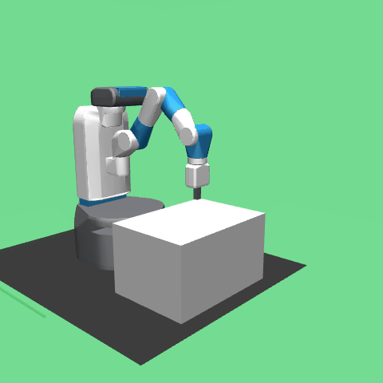

# lang-goal-rl



*What you're watching: one continuous episode. The robot is given a typed
English instruction it has never seen in training ("send the arm climbing
toward the highest point it can reach"), goes for it, then at step 20 gets a
second, opposite instruction ("let the arm descend toward the lowest point
it can reach") — and redirects live, reaching the new target. Both sentences
are from a held-out set verified disjoint from everything the system was
ever trained or tested on. Full provenance:
[demos/README.md](demos/README.md), clip 8.*

**What this is.** An ongoing research program asking how far a
language-commanded embodied agent can get **without any generative model**:
a frozen 22M-parameter sentence encoder (all-MiniLM-L6-v2, revision-pinned)
as the entire language stack, SAC+HER-trained RL policies as the skills, and
a typed command layer as the contract between them. The bet is that this
buys what LLM interfaces can't offer — determinism, certifiability, no GPU,
no connectivity — and the research is measuring exactly what it costs.
Current state: the mechanism is proven on FetchReach (stages 0–11 done), the
project has pivoted from a staged demo arc to an explicit research program
mapping where frozen-embedding grounding breaks. See
[RESEARCH.md](RESEARCH.md) for the full statement.

## Highlights so far

- **Mid-episode English redirection works.** Swapping the target mid-task
  costs nothing measurable: with exact coordinates, redirected episodes
  matched time-budget-matched baselines at 100% on all 8 healthy seeds at
  every switch point tested
  ([stage 5](experiments/05_midepisode_regoal/report.md)); with live typed
  English on never-before-seen phrasings, switch success tracked the
  no-switch baseline exactly (0.857 vs 0.857), redirecting within a median
  of 3 steps ([stage 6](experiments/06_live_english_interface/report.md));
  the typed-command pipeline reproduced it all at 1.000 across 8,640
  episodes ([stage 10](experiments/10_typed_command_interface/report.md)).
- **The command layer refuses to guess.** 23/23 deliberately malformed or
  ambiguous-sounding strings rejected with a specific error naming what was
  wrong; 9/9 valid strings accepted
  ([stage 10](experiments/10_typed_command_interface/report.md)).
- **Intent classification on frozen embeddings.** A small head on the
  frozen encoder classifies free-form English into 5 command types at
  98.08% held-out top-1 (best config, zero variance across seeds; 94.2–98.1%
  across all 12 runs), with 0% of out-of-scope sentences misread as
  actionable ([stage 11](experiments/11_command_type_classification/report.md)).
- **The vocabulary-collision finding — the most original result here.**
  Two intent classes whose training phrasings share a surface convention
  are provably unseparable by frozen embeddings, no matter the tuning. The
  diagnostic fingerprint is crisp: 0% accuracy on one class across every
  hyperparameter config while training loss goes to zero — a data-design
  failure masquerading as a training failure. Found by accident in
  [stage 11](experiments/11_command_type_classification/report.md); no
  published robotics-facing taxonomy of such failures exists (searched
  2026-07-31 — see the
  [viability assessment](docs/research/2026-07-31-thesis-viability-assessment.md)).
  This finding is now the seed of the research program's central thread.
- **Engineering rigor throughout.** 415 tests green in CI on every push,
  the sentence encoder pinned to an exact model revision
  ([`language_embedding.py`](src/lang_goal_rl/language_embedding.py)), and
  every stage's `evidence.md` carries a personally-verified reproduce
  command (convention in [experiments/README.md](experiments/README.md)).

## Where this is going

**[RESEARCH.md](RESEARCH.md)** is the standing research direction
(established 2026-07-31 after an adversarial literature review of the
project's own thesis). Three threads:

1. **The ceiling** — a taxonomy of frozen-embedding grounding failures,
   each with a reproducible diagnostic signature, packaged as a probe suite.
2. **Repair** — structured correction dialogue that warps the
   language→goal grounding map online, per operator, past the frozen
   ceiling.
3. **Manner** — "stay low", "carefully": commands that change *how*, not
   *where* — the hardest case for both.

Next up: stages 12–14 (collision probe, negation probe, second encoder) —
see [PHASE2B_ROADMAP.md](PHASE2B_ROADMAP.md).

## Try it — interactive demo

Open a live window and control the robot from the terminal:

```bash
uv run python -m lang_goal_rl.interactive_demo --seed 0
```

First run downloads the sentence-encoder model (~90MB) from huggingface.co;
after that it's cached locally. For repeat runs you can force offline mode
with `HF_HUB_OFFLINE=1` prepended to the command.

Type an English instruction and press Return. Type another instruction at any
time to redirect the robot without resetting. The terminal prints the nearest
known reference sentence, inferred region, and whether the typed instruction
is a confident match or an extrapolation against the 84-sentence reference
vocabulary. Each episode runs for the real 50-step limit and reports whether
the robot actually reached the target before auto-resetting. Other commands
are `status`, `reset`, and `quit`. If no display is available, the demo falls
back to a live matplotlib window automatically.

## Status & roadmaps

- [STATUS.md](STATUS.md) — current state, stage-by-stage, across every phase
- [RESEARCH.md](RESEARCH.md) — the research program (abstract, threads, next tasks)
- [ROADMAP.md](ROADMAP.md) — Phase 1 staged plan (stages 0-6, frozen)
- [PHASES.md](PHASES.md) — overall phase structure
- [PHASE2_ROADMAP.md](PHASE2_ROADMAP.md) — Phase 2a staged plan (stages 7-10)
- [PHASE2B_ROADMAP.md](PHASE2B_ROADMAP.md) — Phase 2b staged plan (stage 11 done; stages 12-14 are now the probe stages)
- [BLOG.md](BLOG.md) — the casual, first-person story of building this, including the debugging sagas

## Layout

- `src/lang_goal_rl/` — reusable code (env wrappers, goal encoders/projections,
  training utilities). Every experiment imports from here.
- `experiments/` — one directory per stage, run scripts + configs + result
  notes. See `experiments/README.md`.
- `demos/` — curated GIFs with full provenance per clip. See `demos/README.md`.

## Environment contract

- **OS**: developed on macOS/Darwin. CI (see below) runs on `ubuntu-latest`
  headless — every test that touches the env uses `render_mode="rgb_array"`,
  never `render_mode="human"`, so no display is required.
- **Python**: `>=3.12` (per `pyproject.toml`). Managed via `uv`; `uv sync`
  resolves the venv from `uv.lock`.
- **`gymnasium-robotics` / MuJoCo**: pulls in the `mujoco` Python package,
  which ships its own bundled MuJoCo binary — no separate system MuJoCo
  install needed on macOS or Linux. One known quirk from this project's
  history: the originally-planned dependency, `pybullet` (via `panda-gym`),
  failed to build from source on macOS arm64 and was dropped before Stage 0
  in favor of `gymnasium-robotics`'s MuJoCo-backed `FetchReach-v4` — see
  [BLOG.md](BLOG.md)'s day-one entry. That dependency isn't in this repo
  today, noted only so the same trap isn't rediscovered.
- **`sentence-transformers`**: auto-downloads `all-MiniLM-L6-v2` from
  huggingface.co on first use (~90MB) — network access is required unless
  the model is already cached locally. Set `HF_HUB_OFFLINE=1` to force
  offline mode once cached.
- **Test suite runtime**: `uv run pytest tests/lang_goal_rl -q` (415 tests)
  runs in ~15-20s locally with a cached HF model.
- **Disk use**: see [experiments/README.md](experiments/README.md)'s
  artifact-policy section for current repo/experiments sizes and the
  canonical-vs-regenerable artifact split.
