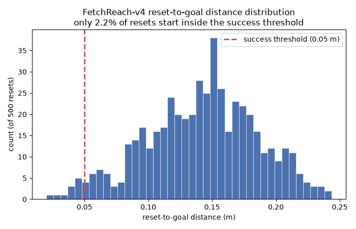

# Trivial Baseline Audit: Is FetchReach-v4's Goal Distribution Too Easy? — Full Evidence


**Date:** 2026-07-27 **Env:** `FetchReach-v4` **Episode length:** 50 steps **Seed:** 0

### Reset-to-goal distance distribution (500 resets, before any action)

| Statistic | Value |
|---|---|
| Min | 0.0199 m |
| 10th percentile | 0.0851 m |
| 25th percentile | 0.1141 m |
| Median | 0.1449 m |
| 75th percentile | 0.1724 m |
| 90th percentile | 0.1986 m |
| Max | 0.2436 m |
| Success threshold | 0.0500 m |
| **Fraction starting within threshold** | **2.2% (11/500)** |

### Trivial-policy success rates (500 episodes each)

| Policy | Success rate | Successes | Median steps-to-success |
|---|---|---|---|
| No-op (all-zero action) | 0.018 | 9/500 | 1 |
| Random (uniform action-space sample) | 0.004 | 2/500 | 12 |
| Oracle (straight-line to goal, perfect info) | 1.000 | 500/500 | 3 |

The no-op success rate (1.8%) closely tracks the fraction of episodes that
start already inside the success threshold (2.2%) — consistent with what a
policy that never moves *should* score, and an independent cross-check that
the reset-distance measurement above is capturing the same thing this
success-rate measurement is.

### Chart


### Cross-reference against every stage's reported result

Multipliers below use the no-op success rate (0.018) as the trivial floor —
the same reference point the plain-English summary uses. The random-policy
floor (0.004) is stricter still; every multiplier in this table would be
roughly 4-5x larger against it.

| Stage | Reported result | vs. no-op floor (0.018) | Note |
|---|---|---|---|
| 1 — UVFA + HER baseline | 1.000 (median/mode, 8/10 seeds) | ~56x | At ceiling — see caveat |
| 2 — Learned goal embedding | 0.998 mean / 1.000 median | ~55-56x | At ceiling (median) — see caveat |
| 3 — Language goal projection | 1.000 (matches stage 2) | ~56x | At ceiling — see caveat |
| 4 — Open vocabulary | 0.571 mean / 1.000 median | ~32x (mean) / ~56x (median) | Mean is the honest headline; median is at ceiling |
| 5 — Mid-episode re-goaling | 1.000 == 1.000 (swap vs. baseline) | ~56x each side | Relative finding — valid at any absolute difficulty; see caveat |
| 6 — Live English interface, Set A | 0.548 | ~30x | Reused stage-4 paraphrases, live pipeline |
| 6 — Live English interface, Set B | 0.857 | ~48x | 7 genuinely new phrasings |

Every real result — even the weakest one measured across all six stages
(0.548, stage 6 Set A) — clears the trivial floor by an order of magnitude.
None of this project's reported success is explained by the reset-distance
geometry alone.

### Known-risks cross-check
This exact check — reset-to-goal distance distribution, or trivial-policy
(no-op/random/oracle) success rates — was not previously measured anywhere
in this project. Confirmed via
`grep -rli "trivial\|no-op.*success\|reset.*distance\|floor.*success" experiments/ src/ --include="*.py" --include="*.md"`
before writing this script: the only hits were unrelated uses of "trivial"
(e.g. describing embedding collapse in stage 3/4) and generic `env.reset()`
calls, not a prior measurement of this kind. None of ROADMAP.md's existing
"Known risks" entries cover this question either — this audit adds new
evidence, it doesn't revisit an existing one. The one caveat it does confirm
and carry forward is the **ceiling effect**: an oracle solving the task in a
median of 3 steps means stages 1-3 and 5's 1.000 scores can't distinguish
"very good" from "perfect" — already implicit in those stages' reports, now
quantified directly.

### Raw output
- [stdout.log](runs/stdout.log)
- [results.json](runs/results.json)

### Reproduce
```
uv run python experiments/00_trivial_baseline_audit/trivial_baseline_audit.py
```
Deterministic: reset-distance sampling, no-op, random, and oracle runs each
use their own fixed, non-overlapping seed block (see
`trivial_baseline_audit.py`'s `*_SEED_OFFSET` constants), so re-running
reproduces every number in this report exactly.
