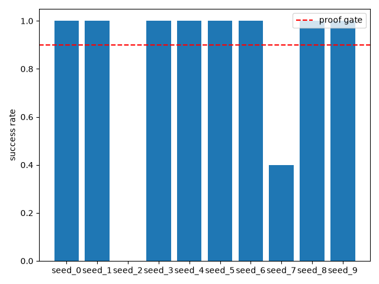

# Stage 1: Goal-conditioned baseline (UVFA + HER)

## In plain English
This stage tests the foundation the whole project is built on: can an agent
learn to reach a target position when it's told the goal as part of its
input, using a training trick (called "hindsight experience replay") that
lets it learn from misses as well as hits? Across 10 independent training
runs, 8 learned the task perfectly (100% success on held-out test episodes)
and 2 failed at test time despite training normally. That failure traces to
a known quirk of the underlying learning algorithm (SAC), not to a problem
with the goal-conditioning idea itself, so this stage is treated as a pass
and becomes the baseline every later stage is compared against.

## Result
**Passed — 8 of 10 independently-seeded runs hit a perfect 1.000 success rate; the 2 failures are a known algorithm-level quirk, not a defect in the approach.**

## How this was tested
Ten separate training runs ("seeds," each starting from different random
initial conditions) were trained on FetchReach, a robot-arm reaching task
where the goal (a target xyz position) is given directly to the agent. Each
trained agent was then evaluated on 50 held-out episodes it never saw during
training, using its most confident (deterministic) action rather than
exploratory ones. Success means the arm reached the target position within
the episode. The proof gate required near-100% success on these held-out
episodes.

---
## Full evidence
The complete technical record — proof gate, full result tables, charts,
raw logs, anomalies, known-risks cross-check, and the reviewer
verdict — lives in [`evidence.md`](evidence.md).
