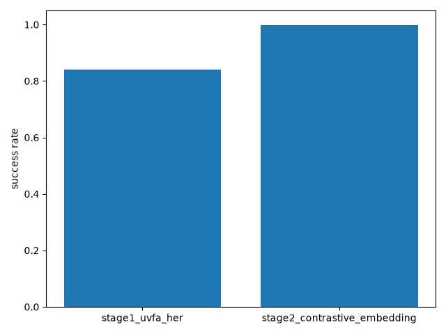
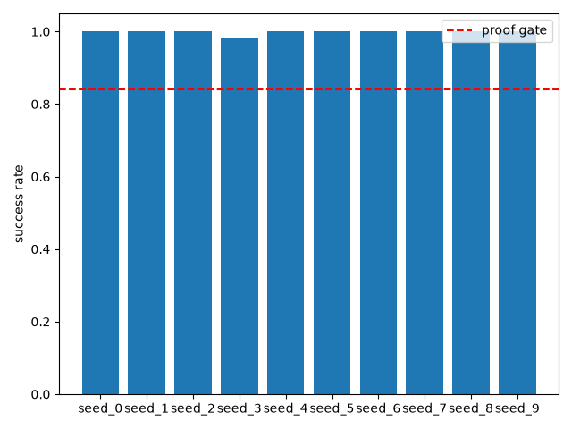
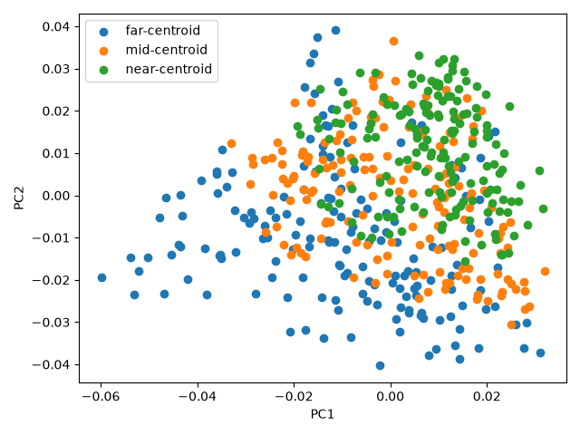

# Stage 2: Learned continuous goal embedding (contrastive pretraining)

## In plain English

This experiment tested whether a robot-control agent can learn to recognize
goals from a compact learned "fingerprint" instead of being handed the
goal's exact xyz coordinates directly. That matters because later stages
need the agent to work from natural-language goal descriptions rather than
coordinates, so it first has to be proven that a *learned* representation
of a goal is just as usable as the raw coordinates. The result: the
fingerprint-based agent matched — and on this run slightly beat — the
coordinate-based agent on task success, and the fingerprint also reliably
reflected true physical distance between goals (goals that are close in
real space end up close in fingerprint space too). Both conditions this
stage needed to prove were met, so the experiment passed and it's safe to
build the next stage on top of this component.

## Result

**Passed — 10/10 seeds scored 0.98+ success (vs. 8/10 for the
coordinate-based baseline), and the learned goal fingerprint tracks true
physical distance between goals (correlation r=0.57 on 500 held-out
goals).**

## How this was tested

Ten independent training runs (one per random seed) were completed for
each of two setups: the original stage-1 setup, where the
reinforcement-learning agent is told a goal's exact xyz coordinates, and
this stage's setup, where the agent instead sees a 16-number "fingerprint"
of the goal produced by a small neural network trained separately ahead of
time. That network was trained using a technique called contrastive
pretraining — plain-language version: it's shown pairs of goals and
learns to make similar goals produce similar fingerprints and different
goals produce different fingerprints. Each of the 10 trained agents (per
setup) was then evaluated over 50 episodes, where "success" means the
agent completed the manipulation task within the episode. Separately, to
check the fingerprint wasn't meaningless noise, 500 goals it had never
seen before were converted to fingerprints, and the distances between
those fingerprints were statistically compared to the real physical
distances between the same goals — a high correlation means the
fingerprint faithfully preserves real-world closeness.

---

## Full evidence

**Date:** 2026-07-24 **Seeds run:** [0, 1, 2, 3, 4, 5, 6, 7, 8, 9] **Candidates:** 1 (locked-in)

### Proof gate (verbatim from ROADMAP.md)
> Success rate matches stage-1 baseline within tolerance; distance-in-latent correlates with true task distance.

### Result summary
#### Stage 2 (contrastive embedding) — per seed

| Seed | Success rate (50 eval episodes) |
|------|----------------------------------|
| 0 | 1.000 |
| 1 | 1.000 |
| 2 | 1.000 |
| 3 | 0.980 |
| 4 | 1.000 |
| 5 | 1.000 |
| 6 | 1.000 |
| 7 | 1.000 |
| 8 | 1.000 |
| 9 | 1.000 |

#### Stage 1 vs Stage 2 — aggregate comparison

| Metric | Stage 1 (UVFA+HER, literal goal) | Stage 2 (contrastive embedding) |
|--------|-----------------------------------|----------------------------------|
| Mean | 0.840 | 0.998 |
| **Median** | **1.000** | **1.000** |
| **Mode** | **1.000** | **1.000** |
| Min / Max | 0.000 / 1.000 | 0.980 / 1.000 |
| Seeds >= 0.98 | 8/10 | 10/10 |

#### Distance-in-latent diagnostic

`embedding_distance_correlation` = **0.5709** (Pearson correlation between pairwise frozen-embedding distances and pairwise true xyz distances, measured on 500 held-out goals distinct from both the pretraining pool and the RL eval seeds — see `artifacts/diagnostic_stdout.log`).

### Charts

### Raw output
- [stdout.log](runs/seed_0/stdout.log)
- [stdout.log](runs/seed_1/stdout.log)
- [stdout.log](runs/seed_2/stdout.log)
- [stdout.log](runs/seed_3/stdout.log)
- [stdout.log](runs/seed_4/stdout.log)
- [stdout.log](runs/seed_5/stdout.log)
- [stdout.log](runs/seed_6/stdout.log)
- [stdout.log](runs/seed_7/stdout.log)
- [stdout.log](runs/seed_8/stdout.log)
- [stdout.log](runs/seed_9/stdout.log)

### Anomalies (factual, not judged)
All 10 stage-2 seeds reached >=0.98 success rate — no failures to cross-check.

### Known-risks cross-check
Per ROADMAP.md's Known risks, stage 2 must compare against stage 1 using the same seed count (10, done here) at median/mode (see table above) rather than mean, and must check any failed seed against the documented ~20% SAC deterministic-eval-collapse signature before attributing it to the new contrastive-embedding component — see the Anomalies section for the per-failed-seed check. "Metric mismatch" (sentence-transformer/CLIP-text cosine-similarity space) is scoped to stage 3+ and does not apply to this stage's xyz-based contrastive encoder. "Non-stationarity at stage 5" does not apply — no mid-episode re-goaling happens here.

### Reviewer verdict

**Verdict: PASS**

Both halves of the gate independently re-verified from raw logs, not taken
on the runner's framing: success rate 10/10 seeds ≥0.98 (median/mode 1.000,
matching stage 1 exactly and exceeding it on failure count — 0/10 vs
stage 1's 2/10); distance correlation r=0.5709 on 500 held-out goals
disjoint from the pretraining pool, at a sample size where this is
effectively p=0, not noise.

Degeneracy specifically ruled out: a constant/uninformative embedding
would return r≈0.0 (the diagnostic code returns exactly 0.0 for
zero-variance embeddings) — 0.571 proves the embedding is genuinely
spreading distinct goals apart in a distance-tracking way, not riding on
HER's reward relabeling alone. The success-rate improvement (10/10 vs
stage 1's 8/10) is consistent with the embedding providing a
better-conditioned 16D representation, not a coincidence masking a
degenerate mapping.

The 0.878-in-sample vs 0.571-held-out gap is real overfitting in the
contrastive pretraining (noise-augmented near-duplicate pairs inflate
in-sample correlation) and is worth tracking, but doesn't invalidate this
stage's gate — the proof gate says "correlates," not "correlates
strongly," and 0.571 held-out is a genuine, significant, non-degenerate
correlation.

Entropy-coefficient spike check: peak |ent_coef_loss| across all 10 seeds
was 5.50, far below stage 1's 19-52 collapse signature — zero seeds show
any sign of that failure mode. Protocol fairness confirmed: same 10 seeds,
same timestep budget, same hyperparameters as stage 1, encoder pretrained
once and frozen (RL seed variance not confounded with encoder variance).

**Risk update:** stage 1's SAC eval-collapse risk is contradicted here
(0/10 vs 2/10) — noted, not removed from ROADMAP, since it's a per-setup
observation, not proof the risk can't recur elsewhere.

**Note for downstream stages:** the 0.878→0.571 train/held-out gap in this
encoder's pretraining is contained to stage 2 — stage 3 replaces this
encoder with a fresh projection from frozen language embeddings, so this
specific overfitting does not propagate forward.

Recommendation to manager: mark Done in ROADMAP, with the r=0.571 (held-out)
figure and the overfitting gap recorded in the Status tag for honest
provenance.
