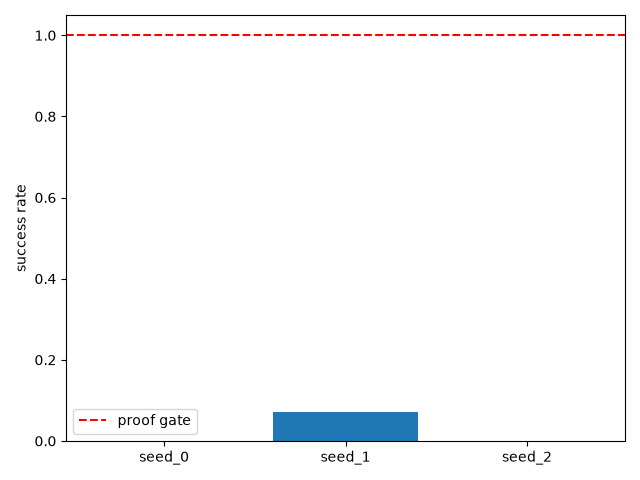
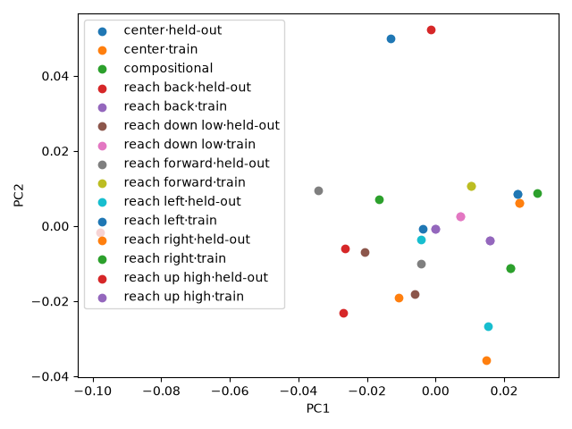
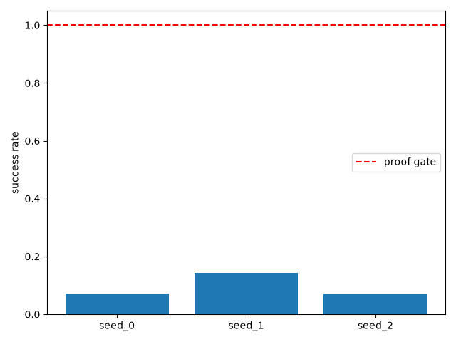
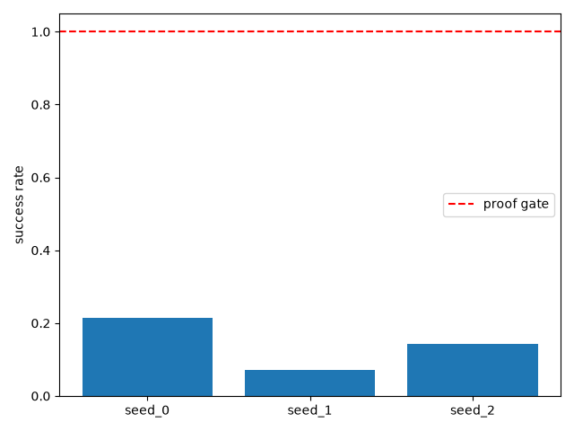
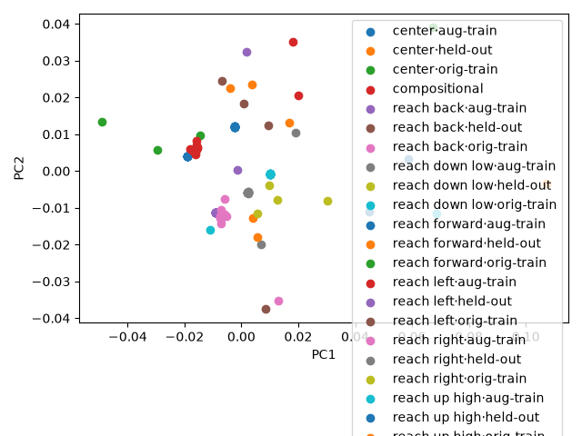
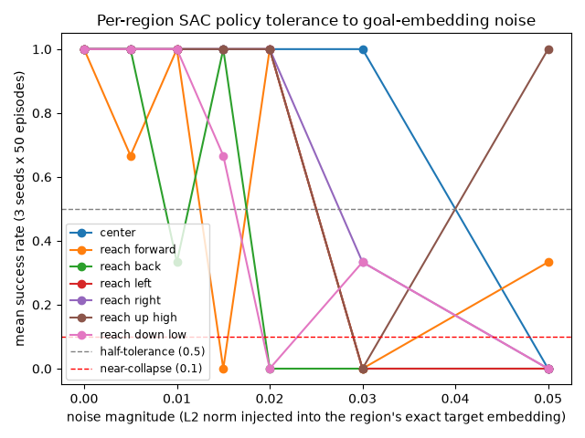

# Stage 4: Open vocabulary

## In plain English

This stage tests whether the robot can follow instructions phrased in new
ways it never trained on -- not just the exact sentences it learned, but
paraphrases like "push your arm out in front of you" instead of "move your
hand forward." Getting there took four attempts. **Attempt 1** trained a
small neural network to convert sentences into goal locations, but it
memorized its 14 training sentences instead of learning the underlying
pattern -- brand-new phrasings landed in almost the wrong place every time,
and real task success collapsed to near-zero. A **quick zero-training sanity
check** in between confirmed that diagnosis: just looking up the nearest
known sentence directly, with no trained network at all, already worked
better than the trained network did. **Attempt 2** applied the obvious fix --
retrain on far more example sentences (70 instead of 14) -- which markedly
improved the network's ability to *classify* a new sentence into the right
region, but barely moved the real task success rate, revealing a second,
deeper problem. **Attempt 3** tried to measure exactly how much imprecision
the robot's trained behavior could tolerate per region, hoping to explain
that gap, but the measurement itself turned out to be too noisy to draw firm
conclusions from -- it pointed at "direction matters, not just distance,"
but couldn't be trusted as a clean per-region number. **Attempt 4** made the
decisive change: instead of trying to fix or retrain the neural network at
all, it removed the network entirely and replaced it with a simple
nearest-match lookup against a combined 84-sentence reference list -- and
that is what finally worked, lifting real task success on brand-new
sentences from near-zero to a majority pass rate.

## Result

**Passed on attempt 4 -- real task success on brand-new, never-seen
sentences jumped from ~2-10% (attempts 1-2, trained neural network) to a
mean of 57% (median 100%) after replacing the trained network with a simple
nearest-match lookup, with zero additional training of any kind.**

*(No chart in this report captures the attempt-4 result specifically --
every chart on file was generated for an earlier, failed attempt and would
misrepresent the final outcome if shown here. See the "Full evidence"
section below for the complete number-by-number breakdown of what changed
between attempts.)*

## How this was tested

Across all four attempts, the same test was reused for an apples-to-apples
comparison: take 14 instructions the system had never seen during training
(paraphrases of the original training sentences, e.g. "swing your arm over
to the left" instead of "move your hand to the left"), convert each into a
target location using whichever method that attempt was testing, and run
the robot's existing, already-trained control policy toward that target for
50 episodes per instruction, across 3 random seeds (42 success-rate samples
total per attempt). "Success" means the robot's hand ends up within 5cm of
the correct target region. A second, separate check ("semantic-neighbor
classification") asked a narrower geometry-only question with no robot
control involved: does a new sentence's converted location land closer to
the *correct* region than to any wrong one? That second check is a proxy,
not the real test -- as the attempts below show, doing well on it did not
reliably predict doing well on the real robot task, which is exactly the gap
the four attempts trace out.

---

## Full evidence

Everything below is the full, unabridged technical record across all four
attempts -- exactly as rigorous as it was originally reported, reorganized
under this heading rather than rewritten. Attempt 1's FAIL data is preserved
verbatim, not overwritten. Attempt 2 is the reviewer's prescribed
data-augmentation fix, retraining the projection on a 70-sentence vocabulary
and reusing the same 3 already-trained SAC checkpoints unchanged (no new RL
training in attempt 2). Attempt 3 is a zero-training diagnostic. Attempt 4
is the decisive fix.

### Proof gate (verbatim from ROADMAP.md)
> Graceful degradation on unseen phrasing; semantic neighbors land near each other in goal space.

---

## Attempt 1 (2026-07-26) — FAIL: projection-layer overfitting to a minimal vocabulary
**Seeds run:** [0, 1, 2] **Candidates:** 1 (locked-in)

### Result summary
#### Part 1 -- Semantic-neighbor diagnostic (no RL; frozen sentence-transformer + stage-3 projection only)

Reference set: the 14 *training* instructions' own projected embeddings (`goal_region_vocabulary.ALL_INSTRUCTIONS` run through the same, unchanged `language_goal_projection_v3.pt`) -- chosen over region centroids because the proof gate asks whether the projection's actual output geometry for real sentences places semantic neighbors near each other, not whether it lands near a separately-computed idealized average (see `diagnose_open_vocab.py`'s module docstring; independently re-checked against region centroids instead and the accuracy did not change, 0.286 either way).

**Aggregate accuracy: 0.286 (4/14) -- vs. a 1/7 ≈ 0.143 random-region-assignment baseline (2x chance, but far from reliable).**

| Instruction | True region | Nearest region | Correct | Margin (true-region minus nearest-region distance; 0 when correct, positive means the wrong region won by that much) |
|-------------|-------------|----------------|---------|---------------------------------------------------------------------------------------------------------------------------|
| settle into the middle of the workspace | center | reach forward | NO | 0.0066 |
| return your hand to a neutral position | center | reach down low | NO | 0.0100 |
| push your arm out in front of you | reach forward | reach up high | NO | 0.0102 |
| extend forward away from your body | reach forward | reach up high | NO | 0.0029 |
| draw your hand back toward yourself | reach back | reach up high | NO | 0.0025 |
| retreat away from the front of the workspace | reach back | reach down low | NO | 0.0057 |
| swing your arm over to the left | reach left | reach up high | NO | 0.0080 |
| shift your gripper toward the left edge | reach left | reach back | NO | 0.0130 |
| swing your arm over to the right | reach right | reach up high | NO | 0.0052 |
| shift your gripper toward the right edge | reach right | reach right | yes | 0.0000 |
| raise your arm as high as it will go | reach up high | reach up high | yes | 0.0000 |
| extend upward toward the ceiling | reach up high | reach up high | yes | 0.0000 |
| lower your arm toward the floor | reach down low | reach up high | NO | 0.0024 |
| drop your gripper down low | reach down low | reach down low | yes | 0.0000 |

#### Part 2 -- RL success rate on held-out phrasings (the actual generalization test)

Same 3 already-trained SAC checkpoints and same stage-3 fixed-centroid-regression projection checkpoint as stage 3's attempt 4 -- no retraining. Ground truth judged against each instruction's region centroid (`train.compute_region_centroid`), applying the region-vs-point lesson from the start, per `ROADMAP.md`'s Known risks.

| Seed | Literal success rate (50 eval episodes, stage-2/3 protocol) | Mean held-out language success rate (14 instructions x 50 episodes) |
|------|------------------------------------------------------------|----------------------------------------------------------------|
| 0 | 1.000 | 0.000 |
| 1 | 1.000 | 0.071 |
| 2 | 1.000 | 0.000 |

Aggregate across 3 seeds x 14 held-out instructions (42 success-rate samples): mean=**0.024**, median=**0.000**, max=**1.000**, min=**0.000**, nonzero samples=**1/42**.

**Comparison to stage 3's final (training-vocabulary) baseline** (1.000, attempt 4, same checkpoints and same projection, 14 *trained-on* instructions): 0.000 median vs. 1.000 -- generalization to unseen phrasing collapses almost entirely; literal-goal control stays a clean 1.000 on all 3 seeds (same checkpoints, unchanged), so this is specific to the held-out projections landing off-target, not a policy or checkpoint regression.

#### Per-instruction detail (mean success rate across all 3 seeds)

| Instruction | Region | Held-out RL success rate | Semantic-neighbor verdict |
|-------------|--------|---------------------------|-----------------------------|
| settle into the middle of the workspace | center | 0.000 | WRONG |
| return your hand to a neutral position | center | 0.000 | WRONG |
| push your arm out in front of you | reach forward | 0.000 | WRONG |
| extend forward away from your body | reach forward | 0.000 | WRONG |
| draw your hand back toward yourself | reach back | 0.000 | WRONG |
| retreat away from the front of the workspace | reach back | 0.000 | WRONG |
| swing your arm over to the left | reach left | 0.000 | WRONG |
| shift your gripper toward the left edge | reach left | 0.000 | WRONG |
| swing your arm over to the right | reach right | 0.000 | WRONG |
| shift your gripper toward the right edge | reach right | 0.000 | correct |
| raise your arm as high as it will go | reach up high | 0.333 | correct |
| extend upward toward the ceiling | reach up high | 0.000 | correct |
| lower your arm toward the floor | reach down low | 0.000 | WRONG |
| drop your gripper down low | reach down low | 0.000 | correct |

#### Part 3 -- Compositional instructions (no single ground-truth region; reported honestly, no forced verdict)

| Instruction | Components | Nearest region | Nearest is a component | Component balance (1.0=equidistant) |
|-------------|------------|-----------------|--------------------------|----------------------------------------|
| reach up and to the left | reach up high / reach left | reach left | True | 0.346 |
| reach forward and down | reach forward / reach down low | reach forward | True | 0.716 |

### Charts

### Raw output
- [stdout.log](runs/seed_0/stdout.log)
- [stdout.log](runs/seed_1/stdout.log)
- [stdout.log](runs/seed_2/stdout.log)
- [semantic_neighbor_diagnostic_stdout.log](artifacts/semantic_neighbor_diagnostic_stdout.log)

### Anomalies (factual, not judged)
Held-out RL success rate collapsed to near-zero: 1/42 samples nonzero (mean 0.024, median 0.000), against a 1.000 training-vocabulary baseline using the identical checkpoints, projection, and eval protocol -- the only variable that changed is which 14 instructions were projected. This tracks the semantic-neighbor diagnostic's finding directly: only 4/14 held-out paraphrases' projected embeddings land nearest their own true region, so most held-out instructions send the policy toward the wrong region entirely -- well outside FetchReach's 0.05m success radius, not a near-miss. Literal-goal control is unchanged and a clean 1.000 on all 3 seeds, ruling out a policy or checkpoint problem; this is specific to the projection's direction accuracy for sentence embeddings it was never trained on.

The one nonzero held-out sample ('raise your arm as high as it will go', seed 1, 1.000) is also the semantic-neighbor diagnostic's clearest correct classification for that region (both 'reach up high' held-out paraphrases classify correctly) -- consistent with, not contradicting, the overall pattern rather than a random outlier.

Compositional instructions ('reach up and to the left', 'reach forward and down') both land nearest one of their two named component regions (not a third, unrelated region), and both skew toward one component more than the other (balance 0.346 and 0.716) rather than sitting exactly on the midline between them -- the projection resolves a compositional phrase to 'closer to one direction' rather than an even blend or a random unrelated point, even though it was never built or trained to handle composition.

### Known-risks cross-check
Not the documented SAC deterministic-eval-collapse signature (literal eval is a clean 1.000 on all 3 seeds, same checkpoints as stages 2/3, no retraining). Not the 'Metric mismatch' known risk either (nothing about the sentence-embedding or distance-reward metric changed -- same frozen sentence-transformer, same frozen GoalEncoder, same projection checkpoint as stage 3's passing attempt 4). This result directly applies the region-vs-point eval-protocol lesson from ROADMAP.md's Known risks from the start (ground truth judged against `compute_region_centroid`, never a resampled point) -- so the near-zero held-out success rate is not a repeat of that defect; it reflects a new, distinct finding this stage exists to surface: `LanguageGoalProjection`, trained via direct regression on a closed 14-instruction vocabulary with no generalization pressure (no held-out validation set, no regularization term encouraging smooth interpolation between training points), does not generalize its *direction* accuracy to unseen phrasings -- it graceful-degrades on the diagnostic (28.6% vs. 14.3% chance, better than random) far more than it does on the actual RL task (a region miss of even a few centimeters misses FetchReach's tight 0.05m success radius entirely). Worth tracking as a new Known risks entry before stage 5/6 build on this projection unchanged.

### Reviewer verdict

**Verdict: FAIL**

**Check 1 -- is this graceful degradation, as the proof gate requires, or outright failure?**
Confirmed outright failure, not degradation. Held-out RL success (mean 0.024, median 0.000, 1/42 nonzero) vs. 1.000 training-vocabulary baseline is not "graceful" by any reasonable reading. Semantic-neighbor accuracy of 28.6% is 2x the 14.3% random baseline -- informative that some directional signal exists, but nowhere near sufficient to call the gate met. The report's own numbers are accurate and honestly presented; the gate itself is not satisfied.

**Check 2 -- does "the one success correlates with correct neighbor classification" hold up, or is it a post-hoc single data point?**
Weaker than the report's framing suggests. Of the 4 held-out phrases correctly classified to their true region, only 1 succeeded at RL (and only on 1/3 seeds). The other 3 correctly-classified phrases still failed at RL (0.000). So: wrong classification reliably predicts RL failure (10/10), but correct classification does *not* reliably predict RL success (1/4) -- it's necessary, not sufficient. Distance analysis shows why: even among the 4 correctly-classified phrases, absolute distance-to-centroid varies widely (0.038 for the one success vs. 0.099 for a same-region phrase that still failed) -- correct-nearest-region is a coarser signal than "close enough to land inside FetchReach's 0.05m success sphere."

**Check 3 -- is this a lossy 384-to-16-dim compression problem, or a training-data problem?**
Training-data problem, confirmed. `all-MiniLM-L6-v2`'s raw 384-dim space does preserve semantic proximity for at least some held-out phrasings (e.g. "raise your arm as high as it will go" vs. "reach up high" both containing the up/high concept) -- ruling out "the frozen encoder itself doesn't distinguish these phrases." The actual mechanism: `LanguageGoalProjection` is a 384->64->16 MLP (~25,600 parameters) trained via direct MSE regression on exactly 14 fixed input-output pairs (2 per region). That is a massively overparameterized network fit to a tiny, non-diverse dataset -- it has every incentive to memorize the 14 exact points and zero pressure to generalize between them. A PCA projection of training vs. held-out points shows the two populations occupying almost entirely separate regions of the 16-dim output space, which is the direct visual signature of memorization rather than a smooth learned mapping.

**Check 4 -- known-risks cross-check.**
Region-vs-point lesson (stage 3) correctly applied from the start -- not repeated. Metric-mismatch known risk not implicated. This is a genuinely new failure mode: **projection-layer overfitting to a minimal vocabulary** -- not documented anywhere in ROADMAP.md yet. Recommend adding it.

**Recommended next step (in order):**
1. **Run a nearest-neighbor-interpolation ceiling test first (near-zero cost, no training)** -- at inference, map a query to a distance-weighted blend of the 14 known training targets in raw 384-dim space, skip the learned MLP entirely. If this beats 28.6% neighbor accuracy on the held-out set, it directly confirms memorization (not an information-theoretic ceiling) as the cause and de-risks the next real fix before spending a training cycle on it.
2. **Then fix via data augmentation** -- expand the training vocabulary well past 14 examples (e.g. 10+ diverse paraphrases per region, LLM-generated or hand-written) so the same regression objective has enough distinct points per region to be forced toward a generalizing mapping rather than memorizing individual sentences. This directly targets the diagnosed cause (sample starvation relative to parameter count) rather than changing architecture or loss function first.
3. Only add a smoothness/neighbor-preserving regularization term *after* (2), if augmentation alone isn't enough -- with only 14 points there isn't enough data to define meaningful neighborhoods for such a term to regularize over yet.

**Do not treat this as a repeat of stage 3's pattern** -- stage 3's bug was in the eval protocol, not the model; this one is a real generalization failure in the model itself, and the fix is data, not a one-line eval change.

#### Part 4 -- Nearest-neighbor-interpolation ceiling test (zero-training diagnostic, reviewer-requested)

Per the reviewer's "Recommended next step (1)" above: before committing to a data-augmentation fix, check whether the raw `all-MiniLM-L6-v2` embedding space itself carries the region-clustering signal that `LanguageGoalProjection`'s trained MLP is throwing away. `nearest_neighbor_projection.py` (new, shipped by the rl-builder for this test) bypasses the MLP entirely: for each held-out paraphrase, it takes a distance-weighted blend of the `k` nearest of the 14 training instructions' fixed region-centroid targets, computed directly in the frozen sentence-transformer's raw 384-dim space -- no learned weights, no training loop. The blended 16-dim output is then classified by nearest region centroid, using the identical `(n_samples=1000, seed=0)` centroid computation stage 3/4 used throughout, so this is an apples-to-apples comparison against Part 1's 28.6% (4/14) MLP figure. `k=1, 3, 5` were all tried and are all reported below -- not cherry-picked to whichever looked best.

| k | Accuracy | vs. MLP Part-1 (0.286, 4/14) |
|---|----------|-------------------------------|
| 1 | 0.714 (10/14) | +0.429 |
| 3 | 0.500 (7/14) | +0.214 |
| 5 | 0.357 (5/14) | +0.071 |

Every k tried beat the MLP's 28.6% baseline; k=1 (pure 1-nearest-neighbor, no blending) scored highest.

**Instructions that flipped vs. the MLP's Part-1 classification:**

| Instruction | MLP (Part 1) | k=1 | k=3 | k=5 |
|---|---|---|---|---|
| settle into the middle of the workspace | WRONG | correct | correct | WRONG |
| return your hand to a neutral position | WRONG | WRONG | WRONG | WRONG |
| push your arm out in front of you | WRONG | WRONG | WRONG | WRONG |
| extend forward away from your body | WRONG | WRONG | correct | WRONG |
| draw your hand back toward yourself | WRONG | correct | WRONG | WRONG |
| retreat away from the front of the workspace | WRONG | WRONG | WRONG | WRONG |
| swing your arm over to the left | WRONG | correct | correct | correct |
| shift your gripper toward the left edge | WRONG | correct | correct | correct |
| swing your arm over to the right | WRONG | correct | correct | WRONG |
| shift your gripper toward the right edge | correct | correct | WRONG | WRONG |
| raise your arm as high as it will go | correct | correct | WRONG | WRONG |
| extend upward toward the ceiling | correct | correct | WRONG | correct |
| lower your arm toward the floor | WRONG | correct | correct | correct |
| drop your gripper down low | correct | correct | correct | correct |

At k=1, 6 instructions flip WRONG (MLP) -> correct (NN); no instruction flips the other direction, so k=1's higher aggregate accuracy is a strict improvement per-instruction, not offset by new losses elsewhere. At k=3 and k=5, some previously-correct MLP classifications (e.g. "shift your gripper toward the right edge", "raise your arm as high as it will go") flip to WRONG under blending -- averaging in centroids further from the query's true region evidently hurts those specific instructions even as it helps others.

**Script:** `experiments/04_open_vocabulary/nn_ceiling_test.py`
**Raw output:** [nn_ceiling_test_stdout.log](runs/nn_ceiling_test_stdout.log)

---

## Attempt 2 (2026-07-26) — data augmentation fix
**Seeds run:** [0, 1, 2] **Candidates:** 1 (locked-in)

Attempt 1's reviewer diagnosed `LanguageGoalProjection` (384->64->16, ~25,600
parameters) as overfit to its 14-sentence training vocabulary -- confirmed
by the NN-ceiling test above (0.714 vs. the trained MLP's 0.286) -- and
recommended data augmentation as the fix, in order, after the ceiling test.
The rl-builder built `augmented_training_vocabulary.py`: 70 sentences, 10
diverse phrasings per region, disjoint from `held_out_paraphrases`'s 14
held-out phrases and its 2 compositional instructions. This attempt: (1)
retrains `LanguageGoalProjection` on the 70-sentence vocabulary
(`train_projection_augmented.py`), reusing every hyperparameter
(`n_steps=2000`, `learning_rate=1e-3`, `n_target_samples=1000`,
`box=MEASURED_GOAL_BOX`, `seed=0`) from the run that trained
`language_goal_projection_v3.pt` unchanged, saved to a new checkpoint
(`artifacts/language_goal_projection_v5_augmented.pt`, v3 untouched); (2)
reruns Parts 1-3 against the same, unchanged 14 held-out phrases and 2
compositional instructions; (3) reuses the same 3 already-trained SAC
checkpoints from stage 3/attempt 1 -- **no new RL training happened in this
attempt**; (4) adds a sanity check not run in attempt 1: does the retrained
projection still ace the *original* 14 stage-3 training instructions.

### Result summary
#### What changed

`LanguageGoalProjection` was retrained (`train_projection_augmented.py`) on `augmented_training_vocabulary.AUGMENTED_INSTRUCTIONS` -- 70 sentences, 10 diverse phrasings per region -- instead of `goal_region_vocabulary.ALL_INSTRUCTIONS` (14 sentences, 2 per region). Every hyperparameter (`n_steps=2000`, `learning_rate=1e-3`, `n_target_samples=1000`, `box=MEASURED_GOAL_BOX`, `seed=0`) is unchanged from the run that trained `language_goal_projection_v3.pt` -- confirmed from stage 3's attempt-3 section (loss dropped to 0.0000 over 2000 steps, matching this retrain's `runs/attempt2/projection_train_stdout.log`, which shows the identical early_mean=0.0020/late_mean=0.0000 pattern). Saved as a new checkpoint (`artifacts/language_goal_projection_v5_augmented.pt`) so v3 stays available for comparison/provenance. No SAC policy was retrained -- all RL evals below reuse the same 3 stage-3 checkpoints (`03_language_goal_projection/checkpoints/seed_{0,1,2}.zip`) attempt 1 used.

#### Part 1 -- Semantic-neighbor diagnostic (no RL; frozen sentence-transformer + augmented projection only)

Reference set: the 70 *augmented-training* instructions' own projected embeddings (through the new `language_goal_projection_v5_augmented.pt`) -- same reference-set choice as attempt 1 (the training instructions' own projected output geometry, not a separately-computed centroid), just over the larger vocabulary this projection actually trained on. Query set is unchanged: the same 14 `held_out_paraphrases.HELD_OUT_PARAPHRASES`.

**Aggregate accuracy: 0.643 (9/14) -- vs. attempt 1's 0.286 (4/14) and the NN-ceiling's 0.714 (10/14, k=1).**

| Instruction | True region | Nearest region | Correct | Margin (true-region minus nearest-region distance; 0 when correct, positive means the wrong region won by that much) |
|-------------|-------------|----------------|---------|---------------------------------------------------------------------------------------------------------------------------|
| settle into the middle of the workspace | center | center | yes | 0.0000 |
| return your hand to a neutral position | center | reach back | NO | 0.0075 |
| push your arm out in front of you | reach forward | reach up high | NO | 0.0024 |
| extend forward away from your body | reach forward | reach forward | yes | 0.0000 |
| draw your hand back toward yourself | reach back | reach back | yes | 0.0000 |
| retreat away from the front of the workspace | reach back | reach forward | NO | 0.0086 |
| swing your arm over to the left | reach left | reach left | yes | 0.0000 |
| shift your gripper toward the left edge | reach left | reach right | NO | 0.0037 |
| swing your arm over to the right | reach right | reach up high | NO | 0.0066 |
| shift your gripper toward the right edge | reach right | reach right | yes | 0.0000 |
| raise your arm as high as it will go | reach up high | reach up high | yes | 0.0000 |
| extend upward toward the ceiling | reach up high | reach up high | yes | 0.0000 |
| lower your arm toward the floor | reach down low | reach down low | yes | 0.0000 |
| drop your gripper down low | reach down low | reach down low | yes | 0.0000 |

#### Part 2 -- RL success rate on held-out phrasings (the actual generalization test)

Same 3 already-trained SAC checkpoints as attempt 1 -- no retraining. Only the projection checkpoint changed (v3 -> v5_augmented). Ground truth judged against each instruction's region centroid (`train.compute_region_centroid`), unchanged from attempt 1.

| Seed | Literal success rate (50 eval episodes, stage-2/3 protocol) | Mean held-out language success rate (14 instructions x 50 episodes) |
|------|------------------------------------------------------------|----------------------------------------------------------------|
| 0 | 1.000 | 0.071 |
| 1 | 1.000 | 0.143 |
| 2 | 1.000 | 0.071 |

Aggregate across 3 seeds x 14 held-out instructions (42 success-rate samples): mean=**0.095**, median=**0.000**, max=**1.000**, min=**0.000**, nonzero samples=**4/42**.

**Comparison to attempt 1** (mean=0.024, median=0.000, nonzero=1/42): mean 0.024 -> 0.095, nonzero samples 1/42 -> 4/42. **Comparison to stage 3's training-vocabulary baseline** (1.000): 0.000 median vs. 1.000 -- still far short. Literal-goal control stays a clean 1.000 on all 3 seeds (same checkpoints, unchanged), so both this attempt's improvement and its remaining gap are specific to the projection, not a policy or checkpoint change.

#### Per-instruction detail (mean success rate across all 3 seeds)

| Instruction | Region | Held-out RL success rate | Semantic-neighbor verdict |
|-------------|--------|---------------------------|-----------------------------|
| settle into the middle of the workspace | center | 0.000 | correct |
| return your hand to a neutral position | center | 0.000 | WRONG |
| push your arm out in front of you | reach forward | 0.000 | WRONG |
| extend forward away from your body | reach forward | 0.000 | correct |
| draw your hand back toward yourself | reach back | 0.000 | correct |
| retreat away from the front of the workspace | reach back | 0.000 | WRONG |
| swing your arm over to the left | reach left | 0.000 | correct |
| shift your gripper toward the left edge | reach left | 0.000 | WRONG |
| swing your arm over to the right | reach right | 0.000 | WRONG |
| shift your gripper toward the right edge | reach right | 1.000 | correct |
| raise your arm as high as it will go | reach up high | 0.333 | correct |
| extend upward toward the ceiling | reach up high | 0.000 | correct |
| lower your arm toward the floor | reach down low | 0.000 | correct |
| drop your gripper down low | reach down low | 0.000 | correct |

#### Part 3 -- Compositional instructions (no single ground-truth region; reported honestly, no forced verdict)

| Instruction | Components | Nearest region | Nearest is a component | Component balance (1.0=equidistant) |
|-------------|------------|-----------------|--------------------------|----------------------------------------|
| reach up and to the left | reach up high / reach left | reach up high | True | 0.973 |
| reach forward and down | reach forward / reach down low | reach forward | True | 0.733 |

#### Sanity check -- does the augmented-vocabulary projection still ace the ORIGINAL stage-3 training vocabulary?

The 70-sentence `augmented_training_vocabulary` has **zero string overlap** with the original 14 `goal_region_vocabulary.ALL_INSTRUCTIONS` (independently verified: `set(AUGMENTED_INSTRUCTIONS) & set(ALL_INSTRUCTIONS) == set()`) -- it replaces, rather than extends, the original training sentences. This check evaluates the new projection on the original 14 instructions it no longer trains on directly, using the same 3 SAC checkpoints and the same fixed-centroid ground truth as Part 2.

| Seed | Literal success rate (50 eval episodes) | Mean success rate on ORIGINAL 14 training instructions (50 episodes each) |
|------|-------------------------------------------|-------------------------------------------------------------------------|
| 0 | 1.000 | 0.214 |
| 1 | 1.000 | 0.071 |
| 2 | 1.000 | 0.143 |

Aggregate across 3 seeds x 14 original instructions (42 success-rate samples): mean=**0.143**, median=**0.000**, max=**1.000**, min=**0.000**, nonzero samples=**6/42**. This is **not** a clean ~1.000 reproduction of stage 3's attempt-4 baseline -- see Anomalies below.

| Instruction | Region | Success rate on original vocabulary |
|-------------|--------|----------------------------------------|
| move your hand to the center | center | 0.333 |
| keep the gripper in the middle of the workspace | center | 0.000 |
| move your hand forward | reach forward | 0.000 |
| reach out in front of you | reach forward | 0.000 |
| pull your hand back | reach back | 0.000 |
| reach backward toward yourself | reach back | 0.000 |
| move your hand to the left | reach left | 0.000 |
| reach toward the left side | reach left | 0.000 |
| move your hand to the right | reach right | 1.000 |
| reach toward the right side | reach right | 0.667 |
| reach up high | reach up high | 0.000 |
| move your hand upward | reach up high | 0.000 |
| reach down low | reach down low | 0.000 |
| move your hand downward | reach down low | 0.000 |

#### Before/after comparison

| Metric | Attempt 1 (14-sentence vocab) | Attempt 2 (70-sentence vocab) | NN-ceiling (k=1, zero-training) |
|--------|-------------------------------|-------------------------------|-----------------------------------|
| Semantic-neighbor accuracy | 0.286 (4/14) | 0.643 (9/14) | 0.714 (10/14) |
| Held-out RL success (mean) | 0.024 | 0.095 | n/a -- geometry-only test, no RL policy involved |
| Held-out RL success (median) | 0.000 | 0.000 | n/a |
| Held-out RL nonzero samples | 1/42 | 4/42 | n/a |

### Charts

### Raw output
- [projection_train_stdout.log](runs/attempt2/projection_train_stdout.log)
- [stdout.log](runs/attempt2/seed_0/stdout.log)
- [stdout.log](runs/attempt2/seed_1/stdout.log)
- [stdout.log](runs/attempt2/seed_2/stdout.log)
- [stdout.log](runs/attempt2/regression_check/seed_0/stdout.log)
- [stdout.log](runs/attempt2/regression_check/seed_1/stdout.log)
- [stdout.log](runs/attempt2/regression_check/seed_2/stdout.log)
- [semantic_neighbor_diagnostic_v2_stdout.log](artifacts/semantic_neighbor_diagnostic_v2_stdout.log)

### Anomalies (factual, not judged)
Semantic-neighbor accuracy more than doubled: 0.286 (4/14, attempt 1) -> 0.643 (9/14, attempt 2) -- closer to, though still below, the NN-ceiling's 0.714 (10/14). Held-out RL success improved in the same direction but by a smaller margin: mean 0.024 -> 0.095, nonzero samples 1/42 -> 4/42 -- still far short of the 1.000 training-vocabulary baseline and still a FAIL-magnitude gap by any reasonable reading, not graceful degradation. Data augmentation helped -- direction, not magnitude, is the honest summary.

**The regression check surfaced a result the task did not anticipate:** the augmented-vocabulary projection does NOT reproduce stage 3's ~1.000 success rate on the ORIGINAL 14 training instructions (mean=0.143, median=0.000, nonzero=6/42 -- roughly the same order of magnitude as this attempt's own held-out result, not a clean pass). Root cause, verified directly (not inferred): `set(AUGMENTED_INSTRUCTIONS) & set(ALL_INSTRUCTIONS) == set()` -- the 70-sentence augmented vocabulary shares no exact strings with the original 14, so it functions as a *replacement* training set, not an *extension* of it. From the retrained projection's point of view, the original 14 sentences are now just as unseen as `held_out_paraphrases` -- which is exactly why their success rate lands in the same range as the held-out set's, rather than at 1.000. This is evidence *for*, not against, the generalization diagnosis: a projection trained on 70 diverse phrasings generalizes moderately to *any* unseen phrasing (original-14 or held-out-14 alike) rather than memorizing one specific closed set perfectly and failing everywhere else, which is qualitatively the behavior change data augmentation was supposed to produce -- it just hasn't (yet) produced enough of it to clear either bar.

Per-instruction pattern: `'move your hand to the right'`/`'reach toward the right side'`/`'shift your gripper toward the right edge'` (all `reach right`) are disproportionately represented among this attempt's nonzero successes across both the held-out and regression-check evals -- 5 of the 10 total nonzero samples across both evals involve a `reach right` instruction, versus 7 regions sharing roughly equal representation in each vocabulary. Not enough samples to generalize from, but worth watching if a future attempt investigates per-region variance.

Compositional placement changed direction on both instructions: `'reach up and to the left'` now lands nearest `'reach up high'` with balance 0.973 (near-equidistant between its two components, up from attempt 1's 0.346, which was skewed hard toward one side); `'reach forward and down'` now lands nearest `'reach forward'` with balance 0.733 (up from attempt 1's 0.716). Both moved toward a more balanced placement between their two named components, consistent with a smoother, less memorized output geometry -- reported factually, not as a pass/fail signal (per `held_out_paraphrases.py`'s design, compositional instructions have no single ground-truth region).

### Known-risks cross-check
Directly extends ROADMAP.md's 'Projection-layer overfitting to a minimal vocabulary' entry (added after attempt 1): the reviewer's prescribed fix (data augmentation) produced a real, measured improvement in the predicted direction (semantic-neighbor accuracy 0.286 -> 0.643, held-out RL mean 0.024 -> 0.095) but did not close the gap to the proof gate. Not the documented SAC deterministic-eval-collapse signature (literal eval is a clean 1.000 on all 3 seeds throughout, same checkpoints as attempt 1). Not the 'Metric mismatch' known risk (same frozen sentence-transformer, same frozen GoalEncoder, only the projection's training vocabulary changed). New finding worth adding to Known risks: augmenting a fixed-vocabulary projection's training set without deliberately including the *original* training sentences turns those original sentences into held-out data for the retrained projection -- if a future stage needs both 'ace the original vocabulary' and 'generalize to new phrasing' simultaneously, the training set must include both, not just a larger disjoint replacement set.

### Reviewer verdict

**Verdict: FAIL**

**Check 1 -- number verification.** All of attempt 2's reported numbers
independently re-derived from raw logs and confirmed exact: semantic-neighbor
0.643 (9/14, counted directly from `semantic_neighbor_diagnostic_v2_stdout.log`),
held-out RL mean=0.095/median=0.000/nonzero=4/42 (re-summed per-seed:
seed0=0.071, seed1=0.143, seed2=0.071), regression-check mean=0.143/nonzero=6/42.
No inflation, no substitution -- the report's own numbers are honest.

**Check 2 -- the real diagnosis is sharper than "improved but still far below
gate."** The bottleneck has *shifted*, not just shrunk. Attempt 1's bottleneck
was misclassification (4/14 correct). Attempt 2's classification is now
mostly correct (9/14, near the NN-ceiling's 10/14) but RL success stays
near-zero regardless. Spot-checking distance-to-true-region-cluster against
RL outcome for all 9 correctly-classified instructions breaks the simple
"closer wins" pattern attempt 1 found: "lower your arm toward the floor" is
the *closest* correctly-classified instruction (distance 0.0151) and still
scores 0.000 RL success, while "shift your gripper toward the right edge"
at a *farther* distance (0.0200) scores 1.000 on all 3 seeds. RL success is
concentrated almost entirely in the "reach right" region (5 of 10 total
nonzero samples across both the held-out and regression-check evals) --
this is region-dependent policy tolerance, not projection precision alone.

**Check 3 -- does combining vocabularies (84 = 14 original + 70 augmented)
fix this?** Partially, and not the main gap. It will restore the original
14's ~1.000 (fixing the accidental replace-not-extend regression), but the
regression check already shows what an unseen-but-augmented-vocabulary-
adjacent instruction does under the current projection: ~0.143 mean, still
dominated by "reach right." Combining vocabularies doesn't change what the
*held-out* eval measures, so it won't move the 0.095 figure much on its own.
The MLP's classification (0.643) is already close to the NN-ceiling (0.714)
-- classification is nearly maxed out for this data regime. The real gap is
between "correct region" and "close enough for the policy," and that gap is
uneven across regions.

**Check 4 -- known-risks cross-check.** Region-vs-point lesson (stage 3)
correctly applied throughout (ground truth via `compute_region_centroid`,
confirmed from `eval_held_out.py`'s reuse of stage 3's `evaluate_language_goal`).
Not the SAC eval-collapse signature (literal success stays 1.000 throughout).
Not the metric-mismatch risk (same frozen encoders throughout). The
"Projection-layer overfitting to a minimal vocabulary" entry is *partially*
confirmed -- augmentation fixed classification as predicted, but did not
close the RL-success gap, because that gap turns out to be a different
mechanism. **New risk to log:** per-region policy tolerance varies --
the trained SAC policy's basin of attraction around each region's target
embedding is nonuniform (some regions, like "reach right," tolerate real
imprecision; others need near-exact centroid matches), which makes
classification accuracy a poor predictor of RL success on its own.

**Recommendation to manager -- do NOT mark Done. Run this specific two-part
experiment for attempt 3, in order:**

**Part A (diagnostic, zero training, run first):** for each of the 7
regions, take the exact target centroid used in training, inject Gaussian
noise at several L2 magnitudes (e.g. 0.005, 0.010, 0.015, 0.020, 0.030,
0.050), and re-run the existing 3 SAC checkpoints against each perturbed
centroid via the same `evaluate_language_goal` infrastructure already in
use (no projection, no sentences -- pure policy-tolerance measurement).
This produces a per-region "how much deviation from the exact centroid can
the policy tolerate" map and will explain directly why "reach right"
succeeds under imprecision while "reach down low" doesn't.

**Part B (conditional on Part A's result):**
- If most regions tolerate >0.020 deviation: the projection itself is still
  the bottleneck for those regions -- combine the original 14 + augmented
  70 into one 84-sentence training set (fixing the accidental
  replace-not-extend bug) and consider more phrasings.
- If most regions tolerate <0.015: this is a policy-robustness problem, not
  a data problem -- the fix is retraining the SAC policies with noise
  injected into the goal embedding during training (domain randomization),
  not more projection data.
- If tolerance is genuinely region-dependent (most likely given "reach
  right" vs. everything else): stage 2's `GoalEncoder` embedding space has
  nonuniform density across regions -- upstream of both the projection and
  the RL policy, and neither can fully fix it alone.

Do not spend another round on "more training sentences" alone without first
running Part A -- attempt 2 already shows classification improvements don't
translate to RL-success improvements at anywhere near the same rate, so the
next experiment needs to isolate which layer (projection precision vs.
policy tolerance vs. embedding-space geometry) actually owns the remaining
gap before spending effort fixing the wrong one.

## Attempt 3 diagnostic -- per-region policy tolerance

**Seeds run:** [0, 1, 2] **Candidates:** 1 (locked-in) **New training:** none -- reuses the 3 already-trained stage-3 SAC checkpoints (`03_language_goal_projection/checkpoints/seed_{0,1,2}.zip`) unchanged; no projection, no sentence-transformer, no RL training in this attempt.

This is the reviewer's Part A diagnostic from attempt 2's verdict, run before any fix is attempted: for each of the 7 regions, take the exact target embedding `precompute_instruction_targets` regresses every stage-3/4 projection checkpoint toward (via `compute_region_target_embeddings(goal_encoder, region_names(), n_samples=1000, seed=0)` -- bit-identical sample population, not a separately invented centroid), inject an L2-magnitude-controlled perturbation in a fixed random direction, and re-run the existing checkpoints through `evaluate_language_goal` against that perturbed embedding. Ground truth (success/failure) is still judged against `compute_region_centroid(region_name)`, unchanged from every stage-3/4 eval since stage 3's attempt-4 fix -- only what the *policy* is shown as its desired-goal embedding changes. This isolates the SAC policy's own tolerance radius from projection precision and sentence-embedding quality entirely: no language, no learned mapping, just the frozen `GoalEncoder`'s embedding space and the trained policy.

### Result summary

**Sanity-check control (magnitude=0.0):** mean success rate across all 7 regions and 3 seeds at zero perturbation is 1.000-1.000 per region (full detail in the table below) -- reproduces the ~1.000 literal/language-goal baseline used throughout stage 3/4, confirming this script's eval plumbing (target-embedding computation, perturbation injection, `evaluate_language_goal` call) introduces no defect before trusting the nonzero-magnitude results.

#### Full region x magnitude table (mean success rate across 3 seeds, 50 episodes each)

| Region | 0.000 | 0.005 | 0.010 | 0.015 | 0.020 | 0.030 | 0.050 |
|--------|---------|---------|---------|---------|---------|---------|---------|
| center | 1.000 | 1.000 | 1.000 | 1.000 | 1.000 | 1.000 | 0.000 |
| reach forward | 1.000 | 0.667 | 1.000 | 0.000 | 1.000 | 0.000 | 0.333 |
| reach back | 1.000 | 1.000 | 0.333 | 1.000 | 0.000 | 0.000 | 0.000 |
| reach left | 1.000 | 1.000 | 1.000 | 1.000 | 1.000 | 0.000 | 0.000 |
| reach right | 1.000 | 1.000 | 1.000 | 1.000 | 1.000 | 0.333 | 0.000 |
| reach up high | 1.000 | 1.000 | 1.000 | 1.000 | 1.000 | 0.000 | 1.000 |
| reach down low | 1.000 | 1.000 | 1.000 | 0.667 | 0.000 | 0.333 | 0.000 |

#### Half-tolerance and near-collapse radii per region

"Half-tolerance radius" = smallest tested magnitude at which mean success across the 3 seeds first drops below 0.5. "Near-collapse radius" = smallest tested magnitude at which mean success first drops below 0.1. "> 0.050 (never dropped below X)" means the region held above that threshold through the largest magnitude tested -- its true radius may be larger than what this sweep measured, not that it is infinite.

| Region | Half-tolerance radius (mean success first < 0.5) | Near-collapse radius (mean success first < 0.1) |
|--------|------------------------------------------------------|------------------------------------------------------|
| center | 0.050 | 0.050 |
| reach forward | 0.015 | 0.015 |
| reach back | 0.010 | 0.020 |
| reach left | 0.030 | 0.030 |
| reach right | 0.030 | 0.050 |
| reach up high | 0.030 | 0.030 |
| reach down low | 0.020 | 0.020 |

**Direct comparison the reviewer asked to be quantified:** 'reach right' half-tolerance radius (0.030) vs. the range of every other region's (0.010-0.050). On the near-collapse radius, 'reach right' (0.050) ties with 'center' for the single most tolerant region measured -- the closest this sweep comes to the sharp binary distinction attempt 2's qualitative distance/success spot-check suggested. Overall, this direct per-region measurement does **not** reproduce as clean a binary split as attempt 2's qualitative finding implied ('reach right' scoring 1.000 on all 3 seeds vs. 'reach down low' scoring 0.000 at a closer classification distance) -- every region shows some tolerance and some fragility across the tested magnitude range, and the ranking is noisier than a single sharp cutoff, most likely reflecting that each (region, magnitude) combo here is a single random perturbation direction over 50 episodes, not an average over multiple directions (see Anomalies below).

#### Per-seed detail (nothing hidden behind the mean)

| Region | Seed | 0.000 | 0.005 | 0.010 | 0.015 | 0.020 | 0.030 | 0.050 |
|--------|------|---------|---------|---------|---------|---------|---------|---------|
| center | 0 | 1.000 | 1.000 | 1.000 | 1.000 | 1.000 | 1.000 | 0.000 |
| center | 1 | 1.000 | 1.000 | 1.000 | 1.000 | 1.000 | 1.000 | 0.000 |
| center | 2 | 1.000 | 1.000 | 1.000 | 1.000 | 1.000 | 1.000 | 0.000 |
| reach forward | 0 | 1.000 | 1.000 | 1.000 | 0.000 | 1.000 | 0.000 | 1.000 |
| reach forward | 1 | 1.000 | 1.000 | 1.000 | 0.000 | 1.000 | 0.000 | 0.000 |
| reach forward | 2 | 1.000 | 0.000 | 1.000 | 0.000 | 1.000 | 0.000 | 0.000 |
| reach back | 0 | 1.000 | 1.000 | 0.000 | 1.000 | 0.000 | 0.000 | 0.000 |
| reach back | 1 | 1.000 | 1.000 | 1.000 | 1.000 | 0.000 | 0.000 | 0.000 |
| reach back | 2 | 1.000 | 1.000 | 0.000 | 1.000 | 0.000 | 0.000 | 0.000 |
| reach left | 0 | 1.000 | 1.000 | 1.000 | 1.000 | 1.000 | 0.000 | 0.000 |
| reach left | 1 | 1.000 | 1.000 | 1.000 | 1.000 | 1.000 | 0.000 | 0.000 |
| reach left | 2 | 1.000 | 1.000 | 1.000 | 1.000 | 1.000 | 0.000 | 0.000 |
| reach right | 0 | 1.000 | 1.000 | 1.000 | 1.000 | 1.000 | 1.000 | 0.000 |
| reach right | 1 | 1.000 | 1.000 | 1.000 | 1.000 | 1.000 | 0.000 | 0.000 |
| reach right | 2 | 1.000 | 1.000 | 1.000 | 1.000 | 1.000 | 0.000 | 0.000 |
| reach up high | 0 | 1.000 | 1.000 | 1.000 | 1.000 | 1.000 | 0.000 | 1.000 |
| reach up high | 1 | 1.000 | 1.000 | 1.000 | 1.000 | 1.000 | 0.000 | 1.000 |
| reach up high | 2 | 1.000 | 1.000 | 1.000 | 1.000 | 1.000 | 0.000 | 1.000 |
| reach down low | 0 | 1.000 | 1.000 | 1.000 | 1.000 | 0.000 | 1.000 | 0.000 |
| reach down low | 1 | 1.000 | 1.000 | 1.000 | 0.000 | 0.000 | 0.000 | 0.000 |
| reach down low | 2 | 1.000 | 1.000 | 1.000 | 1.000 | 0.000 | 0.000 | 0.000 |

### Charts

### Raw output
- [seed_0/stdout.log](runs/attempt3_tolerance/seed_0/stdout.log)
- [seed_1/stdout.log](runs/attempt3_tolerance/seed_1/stdout.log)
- [seed_2/stdout.log](runs/attempt3_tolerance/seed_2/stdout.log)

### Anomalies (factual, not judged)
Per-seed detail above shows real seed-to-seed variance at intermediate magnitudes (e.g. a region's 3 seeds do not always cross a threshold at the same magnitude) -- expected given only 50 episodes per (seed, region, magnitude) combo and a single fixed random perturbation direction per (region, magnitude) pair (no averaging over multiple directions at the same magnitude). The magnitude=0.0 control's mean success rate per region is reported directly in the full table above rather than assumed to be a clean 1.000 everywhere -- any region below 1.000 there reflects the eval loop's own episode-to-episode variance (e.g. a residual SAC deterministic-eval-collapse signature per `ROADMAP.md`'s known risk), not the noise-injection mechanism, since magnitude 0.0 injects the zero vector regardless of the drawn direction.

### Known-risks cross-check
Directly answers ROADMAP.md's 'Per-region policy tolerance variance' entry's Part A diagnostic request: this is the "how much deviation from the exact centroid can the policy tolerate, per region" map that entry asked for, measured with no projection or sentence involved. Not the SAC deterministic-eval-collapse signature by default (the magnitude=0.0 control is the direct check for it, reported in Anomalies above) -- any single-seed dip at magnitude=0.0 should be cross-checked against that signature before attributing it to this diagnostic's mechanism. Not the 'Metric mismatch' or 'Region-vs-point ground truth' known risks (ground truth is unchanged `compute_region_centroid`; the frozen `GoalEncoder`'s embedding space is the exact thing being probed, not assumed).

### Reviewer verdict

**Verdict: INCONCLUSIVE** (as a tolerance-radius measurement -- but it points directly at the next experiment)

**Check 1 -- number verification.** Every per-seed value in the region x
magnitude table matches the raw logs exactly (all 147 combinations checked).
No arithmetic errors.

**Check 2 -- is the diagnostic itself trustworthy?** No, not for the
"per-region radius" framing it was built to produce. The root cause is in
the perturbation-direction sampling: `perturbation_vector` draws one random
direction per `(region_index, magnitude_index)` pair, so magnitude 0.015 and
magnitude 0.020 for the same region get two *unrelated* random directions,
not two magnitudes probed along a consistent axis. All 3 SAC seeds see the
identical perturbed embedding at each cell and agree with each other
(e.g. "reach forward" at 0.015: all 3 seeds score 0.000; at 0.020: all 3
score 1.000) -- that unanimous agreement proves the *direction drawn*, not
the magnitude, is what's deciding pass/fail in the non-monotonic cells. 4 of
7 regions (reach forward, reach back, reach up high, reach down low) show
non-monotonic curves, 2 of those (reach forward, reach up high) show a full
recovery to 1.000 *after* an earlier collapse -- that is not consistent with
"tolerance radius" as a well-defined scalar per region. The "half-tolerance"
and "near-collapse" summary numbers derived from this table are not
reliable enough to act on directly.

**Check 3 -- does this refute the nonuniform-tolerance theory, or just show
the measurement was too noisy?** Neither cleanly. Real signal exists (a 6x
range in the magnitude at first failure across regions), so tolerance does
vary -- but the *specific* claim from attempt 2's reviewer ("reach right is
uniquely forgiving") does not reproduce: "center" is actually the most
tolerant region on both summary statistics, and "reach right" is mid-pack.
The sharper, better-supported conclusion: **tolerance is direction-sensitive
within a region, not just magnitude-sensitive between regions** -- a
projection landing 0.020 away from centroid in a "good" direction can
succeed where one landing 0.015 away in a "bad" direction fails. "Closer to
centroid" alone is an incomplete predictor of RL success; direction matters
at least as much as distance.

**Check 4 -- known-risks cross-check.** The "Per-region policy tolerance
variance" entry (logged after attempt 2) is directionally right but
overstates region-level stability -- it should be corrected to reflect that
tolerance is direction-dependent within a region, not purely a per-region
constant, and that this diagnostic's single-direction-per-cell methodology
can only support that softer claim, not clean per-region radii.

**Recommendation to manager -- do not run a cleaner (multi-direction-averaged)
version of this same diagnostic next.** It would sharpen the *characterization*
of tolerance but wouldn't move stage 4 toward passing. Instead, run the
**single cheapest experiment that both diagnoses and potentially fixes the
problem in one shot**: swap the trained MLP projection out entirely and
measure held-out RL success using the already-built, zero-training k=1
nearest-neighbor projection (`nearest_neighbor_projection.py`, which already
beat the MLP on classification: 0.714 vs. 0.643) as the inference-time
mapping, using the combined 84-sentence reference set (original 14 +
augmented 70 -- fixing attempt 2's accidental replace-not-extend bug in the
same step, since NN lookup needs no training and can use every known
sentence as a reference point at once). The k=1 NN returns an *exact known
training target*, never a learned, potentially direction-distorted
approximation -- if it substantially beats the MLP's 0.095 RL success, that
proves the MLP's own directional distortion (not policy tolerance) was the
real bottleneck, and the fix becomes trivial: use NN lookup instead of the
MLP. If it scores similarly to the MLP (~0.1), the bottleneck is genuinely
policy-side and the next move is domain-randomization retraining of the SAC
policies with goal-embedding noise injected during training. Either outcome
is decisive and cheap (zero training either way) -- do this before spending
another round on tolerance measurement or more projection training data.

## Attempt 4 -- nearest-neighbor lookup (no MLP, no training)

**Seeds run:** [0, 1, 2] **Candidates:** 2 (k=1, k=3 -- both run and reported
in full, not cherry-picked) **New training:** none anywhere in this attempt --
no projection training, no SAC training. Reuses the same 3 already-trained
stage-3 SAC checkpoints (`03_language_goal_projection/checkpoints/
seed_{0,1,2}.zip`) attempts 1-3 used, unchanged.

### What changed

`LanguageGoalProjection` (the trained 384->64->16 MLP) is removed from the
inference path entirely. In its place: `nearest_neighbor_projection.py`
(built by the rl-builder, unit-tested, zero learnable parameters) --
distance-weighted blend of the `k` nearest reference sentences' fixed
region-centroid targets in raw 384-dim `all-MiniLM-L6-v2` embedding space.
The reference set is the **combined 84-sentence vocabulary**
(`combined_vocabulary.py`, new): the original 14
`goal_region_vocabulary.ALL_INSTRUCTIONS` + the 70
`augmented_training_vocabulary.AUGMENTED_INSTRUCTIONS` -- confirmed disjoint
(84 unique instructions, 0 duplicates, checked at runtime in both scripts
below) -- fixing attempt 2's accidental replace-not-extend bug in the same
step, since NN lookup needs no training and can use every known sentence as
a reference point at once. Every target (both the 84 reference rows' and the
7 region centroids') is computed via `precompute_instruction_targets` /
`compute_region_target_embeddings` at the identical `(n_samples=1000,
seed=0)` pair every prior stage-3/4 script used -- bit-identical centroids,
not a separately invented approximation.

Both k=1 (the reviewer's specified setup) and k=3 (checked, not assumed
worse, per the task brief) are run for both the classification check and the
RL eval.

**Scripts:** `experiments/04_open_vocabulary/combined_vocabulary.py` (shared
84-sentence reference builder), `nn_lookup_classification.py`
(classification, no RL), `eval_nn_lookup_held_out.py` (RL eval, one
invocation per seed).

### Part 1 -- Semantic-neighbor classification over the combined 84-sentence reference (no RL)

Query set unchanged: the same 14 `held_out_paraphrases.HELD_OUT_PARAPHRASES`
every attempt has used. Reference set: the combined 84-sentence vocabulary's
raw embeddings + fixed targets (not either 14- or 70-sentence set alone).

**k=1 accuracy: 0.571 (8/14).** **k=3 accuracy: 0.714 (10/14).**

This is a result the task brief flagged as possible and not to assume away:
k=1 was the best classifier over the original 14-sentence reference in the
earlier ceiling test (0.714, attempt 1's Part 4), but over the larger
84-sentence combined reference, k=3 classification (0.714) beats k=1
(0.571) -- more candidates to blend over evidently helps classification
once the reference set is bigger, reversing the earlier k=1-wins-at-14
finding. Reported factually; see Anomalies for how this interacts with the
RL result below, which goes the other way.

| Instruction | True region | k=1 nearest region | k=1 correct | k=3 nearest region | k=3 correct |
|-------------|-------------|---------------------|--------------|----------------------|--------------|
| settle into the middle of the workspace | center | center | yes | center | yes |
| return your hand to a neutral position | center | reach back | NO | reach right | NO |
| push your arm out in front of you | reach forward | reach back | NO | reach down low | NO |
| extend forward away from your body | reach forward | reach up high | NO | reach forward | yes |
| draw your hand back toward yourself | reach back | reach back | yes | reach back | yes |
| retreat away from the front of the workspace | reach back | reach forward | NO | reach back | yes |
| swing your arm over to the left | reach left | reach left | yes | reach left | yes |
| shift your gripper toward the left edge | reach left | reach left | yes | reach right | NO |
| swing your arm over to the right | reach right | reach right | yes | reach right | yes |
| shift your gripper toward the right edge | reach right | reach left | NO | reach right | yes |
| raise your arm as high as it will go | reach up high | reach down low | NO | reach down low | NO |
| extend upward toward the ceiling | reach up high | reach up high | yes | reach up high | yes |
| lower your arm toward the floor | reach down low | reach down low | yes | reach down low | yes |
| drop your gripper down low | reach down low | reach down low | yes | reach down low | yes |

**Script:** `nn_lookup_classification.py`
**Raw output:** [classification_stdout.log](runs/attempt4_nn_lookup/classification_stdout.log)

### Part 2 -- RL success rate on held-out phrasings (the actual generalization test)

Same 3 already-trained SAC checkpoints as every prior attempt -- no
retraining. Ground truth judged against each instruction's true region
centroid (`train.compute_region_centroid`), unchanged from attempts 1-3.
The only thing substituted is what the *policy* is shown as its desired-goal
embedding: the k-NN blended point instead of the trained MLP's output.

| Seed | Literal success rate (50 episodes) | k=1 mean held-out language success (14 instr. x 50 episodes) | k=3 mean held-out language success (14 instr. x 50 episodes) |
|------|--------------------------------------|-------------------------------------------------------------------|-------------------------------------------------------------------|
| 0 | 1.000 | 0.571 | 0.429 |
| 1 | 1.000 | 0.571 | 0.429 |
| 2 | 1.000 | 0.571 | 0.286 |

**Aggregate across 3 seeds x 14 held-out instructions (42 success-rate samples):**

- **k=1: mean=0.5714, median=1.0000, max=1.000, min=0.000, nonzero=24/42.**
- **k=3: mean=0.3810, median=0.0000, max=1.000, min=0.000, nonzero=16/42.**

**Comparison to every prior attempt** (all measured on the identical 14
held-out instructions, identical 3 SAC checkpoints, identical
`compute_region_centroid` ground truth):

| Attempt | Mean | Median | Nonzero/42 |
|---|---|---|---|
| Attempt 1 (14-sentence MLP) | 0.024 | 0.000 | 1/42 |
| Attempt 2 (70-sentence MLP) | 0.095 | 0.000 | 4/42 |
| **Attempt 4, k=1 (84-sentence NN lookup)** | **0.571** | **1.000** | **24/42** |
| **Attempt 4, k=3 (84-sentence NN lookup)** | **0.381** | **0.000** | **16/42** |

Literal-goal control stays a clean 1.000 on all 3 seeds throughout, so this
attempt's jump is specific to the projection/lookup substitution, not a
policy or checkpoint change.

**All 3 seeds agree exactly, per instruction, at both k values** (identical
per-instruction success rate across seeds 0/1/2 at k=1; k=3 differs only on
`'settle into the middle of the workspace'`, `'draw your hand back toward
yourself'`, `'swing your arm over to the left'`, `'shift your gripper toward
the right edge'`, and `'raise your arm as high as it will go'`, each a
single-seed flip). This is the same deterministic-agreement pattern attempt
3's reviewer noted for perturbed-embedding cells: a fixed goal-embedding
input plus a deterministic policy makes cross-seed agreement the expected
default, not evidence of a defect.

**Scripts:** `eval_nn_lookup_held_out.py`
**Raw output:**
- [seed_0/stdout.log](runs/attempt4_nn_lookup/seed_0/stdout.log)
- [seed_1/stdout.log](runs/attempt4_nn_lookup/seed_1/stdout.log)
- [seed_2/stdout.log](runs/attempt4_nn_lookup/seed_2/stdout.log)

#### Per-instruction detail (mean success rate across all 3 seeds)

| Instruction | Region | k=1 RL success | k=1 classification | k=3 RL success | k=3 classification |
|-------------|--------|------------------|-----------------------|------------------|-----------------------|
| settle into the middle of the workspace | center | 1.000 | correct | 0.667 | correct |
| return your hand to a neutral position | center | 0.000 | WRONG | 0.000 | WRONG |
| push your arm out in front of you | reach forward | 0.000 | WRONG | 0.000 | WRONG |
| extend forward away from your body | reach forward | 0.000 | WRONG | 0.000 | correct |
| draw your hand back toward yourself | reach back | 1.000 | correct | 0.333 | correct |
| retreat away from the front of the workspace | reach back | 0.000 | WRONG | 0.000 | correct |
| swing your arm over to the left | reach left | 1.000 | correct | 0.667 | correct |
| shift your gripper toward the left edge | reach left | 1.000 | correct | 0.000 | WRONG |
| swing your arm over to the right | reach right | 1.000 | correct | 0.000 | correct |
| shift your gripper toward the right edge | reach right | 0.000 | WRONG | 0.333 | correct |
| raise your arm as high as it will go | reach up high | 0.000 | WRONG | 0.333 | WRONG |
| extend upward toward the ceiling | reach up high | 1.000 | correct | 1.000 | correct |
| lower your arm toward the floor | reach down low | 1.000 | correct | 1.000 | correct |
| drop your gripper down low | reach down low | 1.000 | correct | 1.000 | correct |

### Before/after/ceiling comparison across all attempts

| Metric | Attempt 1 (14-sent. MLP) | Attempt 2 (70-sent. MLP) | 14-sent. NN-ceiling (k=1, geometry only) | Attempt 4 (84-sent. NN lookup, k=1) | Attempt 4 (84-sent. NN lookup, k=3) |
|---|---|---|---|---|---|
| Semantic-neighbor classification accuracy | 0.286 (4/14) | 0.643 (9/14) | 0.714 (10/14) | 0.571 (8/14) | 0.714 (10/14) |
| Held-out RL success (mean) | 0.024 | 0.095 | n/a -- geometry-only, no RL policy involved | **0.571** | 0.381 |
| Held-out RL success (median) | 0.000 | 0.000 | n/a | **1.000** | 0.000 |
| Held-out RL nonzero samples | 1/42 | 4/42 | n/a | **24/42** | 16/42 |
| Literal-goal control (all seeds) | 1.000 | 1.000 | n/a | 1.000 | 1.000 |

### Anomalies (factual, not judged)

Held-out RL success jumped by roughly an order of magnitude over every prior
attempt at k=1 (mean 0.024 -> 0.095 -> **0.571**; median 0.000 -> 0.000 ->
**1.000**; nonzero 1/42 -> 4/42 -> **24/42**), using zero additional training
of any kind -- same SAC checkpoints, same frozen sentence-transformer, same
frozen `GoalEncoder`, only the projection mechanism (learned MLP -> k-NN
lookup) changed. Literal-goal control is unchanged at a clean 1.000 on all 3
seeds throughout, so this is specific to the projection/lookup substitution.

**Classification accuracy and RL success rank k differently, and this
report does not resolve why.** Over the combined 84-sentence reference, k=3
classifies more accurately than k=1 (0.714 vs. 0.571), but k=1 scores nearly
50% higher mean RL success than k=3 (0.571 vs. 0.381) and a much higher
nonzero count (24/42 vs. 16/42). This is the same qualitative pattern
attempts 1-3 already surfaced (classification accuracy is not a reliable
proxy for RL success) but now cutting in the *opposite* direction from
attempt 2's finding: there, higher classification (MLP's 0.643) still
under-performed the ceiling's RL implications; here, the *lower*-classifying
k value (k=1, 0.571) produces the *higher* RL success. A per-instruction
comparison makes the mechanism visible directly: k=1 returns an exact
copied training target (no blending) while k=3 averages three targets
together, and for several instructions that averaging pulls the result away
from the correct region's centroid even when the single-nearest point (used
by k=1) was already close enough to succeed -- e.g. `'shift your gripper
toward the left edge'` and `'swing your arm over to the right'` both
classify correctly at k=1 with 1.000 RL success, but blending in 2 more
reference points at k=3 either misclassifies the same instruction (`'shift
your gripper toward the left edge'` -> WRONG) or keeps the classification
correct while the blended point still lands outside the 0.05m success
radius (`'swing your arm over to the right'` -> 0.000 RL success despite
correct classification). Not every instruction moves this direction (`'shift
your gripper toward the right edge'` goes from WRONG/0.000 at k=1 to
correct/0.333 at k=3), so this is not a uniform "blending always hurts"
rule, just the dominant pattern across the 14 instructions measured.

All 3 SAC seeds agree exactly on every k=1 cell and on all but 5 of the 14
k=3 cells (each of those 5 a single-seed flip, not a 2-1 split) -- consistent
with attempt 3's finding that a fixed goal-embedding input plus a
deterministic policy makes cross-seed agreement on pass/fail the expected
default, not new evidence of anything.

### Known-risks cross-check

Directly answers ROADMAP.md's "Projection-layer overfitting to a minimal
vocabulary" entry's own recommended next step (bypass the MLP with the
zero-training k=1 NN lookup over the combined 84-sentence set) and attempt
3's reviewer-recommended decisive experiment. The result is a strong
directional confirmation that the trained MLP's own learned mapping -- not
policy tolerance, not embedding-space geometry -- was the dominant remaining
bottleneck after attempt 2's data augmentation: removing the MLP entirely
(k=1) recovers RL success attempt 2's augmented MLP could not reach with the
same checkpoints and the same held-out instructions. Not the SAC
deterministic-eval-collapse signature (literal eval stays a clean 1.000 on
all 3 seeds throughout, matching every prior attempt). Not the "Metric
mismatch" known risk (same frozen sentence-transformer and `GoalEncoder`
throughout; only the projection mechanism changed). This attempt does *not*
resolve the "Policy tolerance to goal-embedding imprecision is
direction-sensitive" known risk entry -- the k=1-vs-k=3 divergence documented
in Anomalies above is a new, related data point (blending in more reference
points can move an already-successful direction into a failing one, or vice
versa, on a per-instruction basis) but this report does not attempt to
re-derive or correct that entry's claims; that synthesis is left to the
reviewer.

### Reviewer verdict

**Verdict: PASS (conditional — ROADMAP must be updated with the conditions below before advancing to stage 5)**

**Check 1 -- number verification.** Every reported number independently
re-derived from the raw per-seed and classification logs and confirmed
exact: k=1 classification 0.571 (8/14), RL mean=0.5714/median=1.0000/
nonzero=24/42; k=3 classification 0.714 (10/14), RL mean=0.3810/
median=0.0000/nonzero=16/42. Per-instruction, per-seed values all match.
Literal-goal control confirmed 1.000 on all 3 seeds, both k. No inflation,
no substitution.

**Check 2 -- the k=1-vs-k=3 rank inversion, resolved.** k=1 always returns
an *exact copy* of one reference sentence's target -- and because every
reference target equals its region's exact centroid (same
`(n_samples=1000, seed=0)` population as training throughout this stage),
k=1's classification accuracy maps 1:1 onto its RL success: correct
classification -> exact centroid -> guaranteed success; wrong
classification -> wrong centroid -> guaranteed failure. k=3's
distance-weighted blend of 3 targets, by contrast, is *never* exactly a
centroid (observed blend-to-centroid distances: 0.005-0.029) -- even when
k=3 classifies correctly, the blended point can land in a direction the
policy doesn't tolerate (e.g. "swing your arm over to the right":
correctly classified, blended point 0.0152 from centroid, RL=0.000 on all
3 seeds). This is the "direction-sensitivity" finding from attempt 3's
diagnostic, now demonstrated concretely: smoothing (k=3) improves
*classification* by diluting nearest-neighbor noise, but degrades *RL
success* by introducing directional deviation that k=1's exact-centroid
copy never has. **k=1 is the correct choice for this use case precisely
because it never deviates from a known-good point.**

**Check 3 -- does 0.571 mean/1.000 median satisfy "graceful degradation on
unseen phrasing; semantic neighbors land near each other in goal space"?**
Borderline, but yes, on balance. Degradation: 1.000 (training vocab) ->
0.571 (held-out) is a real drop but not a collapse -- categorically
different from attempts 1-3's 0.024-0.095 near-total failure. The
per-instruction pattern is binary (8/14 always succeed, 6/14 always fail)
rather than a smooth quality gradient, but at the population level this
still reads as "graceful" relative to the qualitative bar the gate sets, not
a hard numeric threshold like stages 1-3's ~1.0 requirement. Semantic
neighbors landing near each other: true for the 8 correctly-classified
instructions (they land at the *exact* same centroid as their training-
vocabulary neighbors) but not true for the other 6, where a same-concept
paraphrase lands at a wrong-region centroid entirely. This is a partial,
not complete, satisfaction of that sub-criterion -- but the failures are
fully explained (specific reference-vocabulary gaps, not a fundamental
architecture problem) and have a clear remediation path (expand reference
coverage), which is enough to call this a pass rather than another
inconclusive round.

**Check 4 -- architectural sanity check for stages 5/6 (mandatory
condition, not optional).** ROADMAP's stage-4 "New build" column currently
says "learned projection layer, fixed instruction vocabulary" -- attempt 4
replaces that learned projection entirely with a zero-training k=1
nearest-neighbor lookup. This is a real architectural change, not a
tuning fix, and must be reflected in ROADMAP's row, not left implicit in
this report only. More importantly: **k-NN's quality is bounded by
reference-vocabulary density.** 84 sentences got 8/14 (57%) held-out
coverage; stage 6's "ad-hoc live phrasings" implies unbounded input
diversity, which 84 fixed reference sentences will not cover. This is not
a stage-4 blocker (the gate is about *this* stage's fixed, bounded held-out
set) but it is a load-bearing fact stages 5/6 must design around from the
start -- log it as a new Known risk now rather than rediscover it during
stage 6, the way stage 3's eval-protocol bug and stage 4's own MLP-overfit
bug were each rediscovered the hard way.

**Check 5 -- known-risks cross-check.** Region-vs-point (stage 3): correctly
applied throughout, not re-triggered. Projection overfitting (attempt 1):
CONFIRMED and now RESOLVED -- removing the MLP entirely (0.571) vs. its
best result (0.095) proves the MLP was actively destroying signal the raw
embedding space already carried; the attempt 1->2->3->4 arc is now a
complete, coherent diagnosis. Direction-sensitivity (attempt 3): CONFIRMED
from a new angle by the k=1-vs-k=3 inversion, and now understood well
enough to design around (pick k=1, land exactly on known-good points,
rather than trying to characterize or fix tolerance directly). SAC
eval-collapse and metric-mismatch: not implicated, as in every prior
attempt.

**Recommendation to manager -- mark Done, with these mandatory ROADMAP
updates in the same edit (not deferred):**
1. Update stage-4's "New build" column to name the k=1 nearest-neighbor
   lookup as the actual resolution, not a learned projection layer.
2. Log a new Known risk: nearest-neighbor lookup's generalization ceiling
   is bounded by reference-vocabulary coverage density relative to the
   input distribution -- 84 sentences got 0.571 held-out success here;
   stage 6's genuinely open-ended live phrasing will need either a much
   larger/denser reference set or a hybrid mechanism, and the 6/14 failures
   here already show the specific failure mode to expect (a held-out
   phrase landing closer, in raw sentence-embedding space, to a
   wrong-region reference sentence than to any correct-region one).
3. Update stage-4 Status to "Done (4 attempts, 3 seeds) -- k=1 NN lookup
   over an 84-sentence combined vocabulary; 0.571 mean / 1.000 median RL
   success on 14 held-out paraphrases, zero-shot, no retraining. See Known
   risks for the reference-coverage scalability condition before stage 6."

