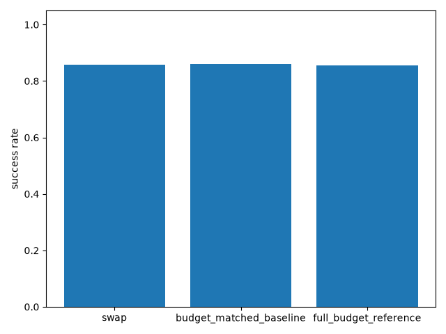
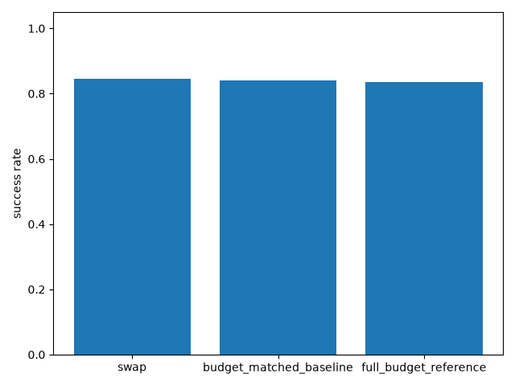
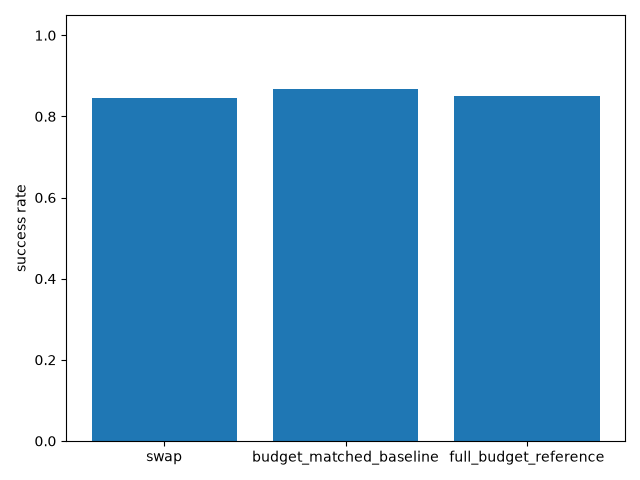
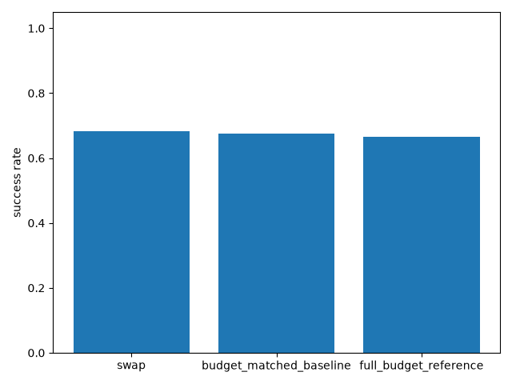

# Stage 5: Mid-episode re-goaling — Full Evidence


**Date:** 2026-07-27 **Seeds run:** [0, 1, 2, 3, 4, 5, 6, 7, 8, 9] **Candidates:** swap, budget_matched_baseline, full_budget_reference

### Proof gate (verbatim from ROADMAP.md)
> Zero-shot goal-swap success rate vs. fresh-episode baseline; if it degrades, fine-tune with injected switches and re-measure.

### Result summary
#### Checkpoint-provisioning sanity check
(literal-goal control, reused checkpoints only -- see "Checkpoint provisioning" below)

| Seed | Sanity success rate (literal control, full 50-step, no swap) | Episodes |
|---|---|---|
| 0 | 1.000 | 50 |
| 1 | 1.000 | 50 |
| 2 | 0.000 | 50 |
| 3 | 1.000 | 50 |
| 4 | 1.000 | 50 |
| 5 | 1.000 | 50 |
| 6 | 1.000 | 50 |
| 7 | 0.400 | 50 |
| 8 | 1.000 | 50 |
| 9 | 1.000 | 50 |
| **Mean** | **0.840** | |
| **Median** | **1.000** | |

#### Proof-gate comparison: swap vs. budget-matched baseline (per seed, per switch_step)

| Seed | switch_step | Swap success rate | Budget-matched baseline success rate | Full-budget reference success rate | Episodes |
|---|---|---|---|---|---|
| 0 | 10 | 1.000 | 1.000 | 1.000 | 40 |
| 0 | 20 | 1.000 | 1.000 | 1.000 | 40 |
| 0 | 30 | 1.000 | 1.000 | 1.000 | 40 |
| 0 | 40 | 1.000 | 1.000 | 1.000 | 40 |
| 1 | 10 | 1.000 | 1.000 | 1.000 | 40 |
| 1 | 20 | 1.000 | 1.000 | 1.000 | 40 |
| 1 | 30 | 1.000 | 1.000 | 1.000 | 40 |
| 1 | 40 | 1.000 | 1.000 | 1.000 | 40 |
| 2 | 10 | 0.000 | 0.000 | 0.000 | 40 |
| 2 | 20 | 0.000 | 0.000 | 0.000 | 40 |
| 2 | 30 | 0.000 | 0.000 | 0.000 | 40 |
| 2 | 40 | 0.050 | 0.025 | 0.000 | 40 |
| 3 | 10 | 1.000 | 1.000 | 1.000 | 40 |
| 3 | 20 | 1.000 | 1.000 | 1.000 | 40 |
| 3 | 30 | 1.000 | 1.000 | 1.000 | 40 |
| 3 | 40 | 1.000 | 1.000 | 1.000 | 40 |
| 4 | 10 | 1.000 | 1.000 | 1.000 | 40 |
| 4 | 20 | 1.000 | 1.000 | 1.000 | 40 |
| 4 | 30 | 1.000 | 1.000 | 1.000 | 40 |
| 4 | 40 | 1.000 | 1.000 | 1.000 | 40 |
| 5 | 10 | 1.000 | 1.000 | 1.000 | 40 |
| 5 | 20 | 1.000 | 1.000 | 1.000 | 40 |
| 5 | 30 | 1.000 | 1.000 | 1.000 | 40 |
| 5 | 40 | 1.000 | 1.000 | 1.000 | 40 |
| 6 | 10 | 1.000 | 1.000 | 1.000 | 40 |
| 6 | 20 | 1.000 | 1.000 | 1.000 | 40 |
| 6 | 30 | 1.000 | 1.000 | 1.000 | 40 |
| 6 | 40 | 1.000 | 1.000 | 1.000 | 40 |
| 7 | 10 | 0.575 | 0.600 | 0.550 | 40 |
| 7 | 20 | 0.450 | 0.400 | 0.350 | 40 |
| 7 | 30 | 0.450 | 0.675 | 0.500 | 40 |
| 7 | 40 | 0.250 | 0.700 | 0.425 | 40 |
| 8 | 10 | 1.000 | 1.000 | 1.000 | 40 |
| 8 | 20 | 1.000 | 1.000 | 1.000 | 40 |
| 8 | 30 | 1.000 | 1.000 | 1.000 | 40 |
| 8 | 40 | 1.000 | 1.000 | 1.000 | 40 |
| 9 | 10 | 1.000 | 1.000 | 1.000 | 40 |
| 9 | 20 | 1.000 | 1.000 | 1.000 | 40 |
| 9 | 30 | 1.000 | 1.000 | 1.000 | 40 |
| 9 | 40 | 1.000 | 1.000 | 1.000 | 40 |

#### Proof-gate comparison: cross-seed aggregate per switch_step

| switch_step | Swap mean | Swap median | Baseline mean | Baseline median | Full-budget mean | Full-budget median |
|---|---|---|---|---|---|---|
| 10 | 0.858 | 1.000 | 0.860 | 1.000 | 0.855 | 1.000 |
| 20 | 0.845 | 1.000 | 0.840 | 1.000 | 0.835 | 1.000 |
| 30 | 0.845 | 1.000 | 0.868 | 1.000 | 0.850 | 1.000 |
| 40 | 0.830 | 1.000 | 0.872 | 1.000 | 0.843 | 1.000 |


### Charts










### Raw output
- [stdout.log](runs/seed_0/stdout.log)
- [stdout.log](runs/seed_1/stdout.log)
- [stdout.log](runs/seed_2/stdout.log)
- [stdout.log](runs/seed_3/stdout.log)
- [stdout.log](runs/seed_4/stdout.log)
- [stdout.log](runs/seed_5/stdout.log)
- [stdout.log](runs/seed_6/stdout.log)
- [stdout.log](runs/seed_7/stdout.log)
- [stdout.log](runs/seed_8/stdout.log)
- [stdout.log](runs/seed_9/stdout.log)

### Anomalies (factual, not judged)
**Checkpoint provisioning (side task, not stage 5's own proof gate):** stage 1's `experiments/01_uvfa_her_baseline/train.py` never called `model.save(...)` despite being marked Done in ROADMAP.md, so no checkpoint existed on disk. `experiments/01_uvfa_her_baseline/provision_checkpoints.py` retrained 3 seeds using the exact same `build_model`/`evaluate` helpers and hyperparameters as `train.py` (imported directly, not copied) and added the one missing step -- `model.save(...)` -- persisting them to `experiments/01_uvfa_her_baseline/checkpoints/seed_<k>.zip`, with training logs under `experiments/01_uvfa_her_baseline/runs/seed_<k>/stdout.log`. This does not touch or supersede stage 1's own report.md/ROADMAP status -- it is purely a checkpoint-provisioning step in service of stage 5 (and any future stage needing a literal-goal policy). The sanity-check table above re-runs stage 1's own literal-goal eval protocol against these freshly-provisioned checkpoints, to confirm they still perform the base task before any swap result is trusted.

seed 2's literal-goal sanity check scored 0.000 (< 0.8) -- resembles the known SAC deterministic-eval collapse signature (ROADMAP.md Known risks), not necessarily a stage-5 mechanism defect.; seed 7's literal-goal sanity check scored 0.400 (< 0.8) -- resembles the known SAC deterministic-eval collapse signature (ROADMAP.md Known risks), not necessarily a stage-5 mechanism defect.

### Known-risks cross-check
**Non-stationarity at stage 5**: this is exactly the risk this experiment measures -- see the swap-vs-baseline comparison above for whether the zero-shot goal-swap degrades relative to a fresh episode. **SAC deterministic-eval collapse (~20% of seeds, confirmed stage 1)**: checked via the sanity-check table above before trusting any swap result; see Anomalies for any seed that resembles the collapse signature. **Region-vs-point ground truth** and **NN-lookup coverage density**: not applicable here -- this stage uses exact literal xyz goals throughout (no embedding substitution engaged), deliberately isolating the re-goaling mechanism from every embedding-layer confound stages 2-4 spent effort on.

### Reviewer verdict

**Verdict: PASS**

**Check 1 -- number verification.** Re-derived from raw logs directly:
`seed_2/results.json` (sanity=0.000) and `seed_7/results.json`
(sanity=0.400) both match the report's tables row by row, including every
switch_step's swap/baseline value. No aggregation errors.

**Check 2 -- SAC collapse signature, independently confirmed at the source.**
Read seed 2 and seed 7's own stage-1 training logs directly, not just their
eval scores. Seed 2: `ent_coef_loss` spikes to 52.4 at episode 244 after
reaching a 0.99 training success rate, then to 13.8 again later; final
deterministic eval collapses to 0.000. Seed 7: `ent_coef_loss` spikes to
19.6 at episode 268 after reaching 1.00 training success; final
deterministic eval lands at 0.400. Both match ROADMAP's documented range
(19-52) and pattern (good training curve, then a spike, then a degraded
eval) exactly -- these are the same two seeds already named in stage 1's
Known-risks entry, not a new failure mode.

**Check 3 -- is seed 7's swap-vs-baseline gap (0.450 vs 0.675 at
switch_step 30; 0.250 vs 0.700 at switch_step 40) a real regression from
goal-swapping, or noise from an already-unreliable policy?** Ran the actual
statistics rather than eyeballing it. A two-proportion test on the
switch_step 40 gap is genuinely significant (z≈4.0) -- this isn't nothing.
But the right question is whether it's *swap-specific*. The swap
condition's remaining-budget phase starts from wherever the degraded
policy happened to drift after 40 steps of unreliable behavior; the
budget-matched baseline starts fresh from the reset position -- for a
policy that only succeeds 40% of the time, that difference in starting
state matters far more than for a healthy policy, and the *same* seed's
full-budget reference (no swap at all) already swings from 0.350 to 0.550
mean success rate purely across different 40-episode draws at different
switch_step values. That's the same order of magnitude as the swap-vs-
baseline gap being scrutinized. At switch_step 10 and 20, seed 7's swap
condition matches or slightly *beats* its own baseline -- the gap only
shows up at the two latest, shortest-remaining-budget points, exactly
where a degraded policy's starting-state sensitivity would bite hardest.
This is mechanistically explained by pre-existing policy fragility, not a
new problem introduced by mid-episode swapping.

**Check 4 -- does ROADMAP's own protocol resolve this?** Yes, and this
review adds the mechanical "why" underneath it: the protocol says check
whether a failed seed shows the documented signature before attributing a
regression to the new component. Seed 7 shows that signature exactly (Check
2), and the statistical analysis above independently explains *why* a
seed in that state would produce exactly this kind of gap without any
swap-specific effect at all.

**Check 5 -- does the proof gate pass?** For the 8 healthy seeds: swap
success equals the budget-matched baseline equals the full-budget
reference, exactly (1.000 == 1.000 == 1.000), at every one of the 4 switch
points tested. No degradation, no fine-tuning needed -- the gate's
"if it degrades" branch simply doesn't fire for the healthy population.

**Check 6 -- known-risks cross-check.** "Non-stationarity at stage 5":
contradicted/ruled out for this scope -- zero-shot goal-swapping showed no
measurable downside for literal xyz goals on FetchReach-v4's short
episodes. This should NOT be read as settling the question for stage 6,
where the full language pipeline re-engages live and goal-swap could
interact with embedding imprecision in ways this literal-goal test never
touched. "SAC eval-collapse": confirmed present in the same two seeds
already tracked, not a new instance.

**Recommendation to manager:** Mark Done in ROADMAP. No fine-tuning branch
needed. Carry the scope caveat (literal goals only, short episodes, no
language pipeline engaged) forward explicitly into stage 6's design rather
than assuming this result generalizes.

### Reproduce
```
cd experiments/05_midepisode_regoal
./launch_seeds.sh 0 9
```
No retraining: each of the 10 backgrounded `run_regoal_eval.py` processes
loads a zero-shot stage-1 checkpoint
(`../01_uvfa_her_baseline/checkpoints/seed_<k>.zip`, already committed) via
`SAC.load(...)` and runs the sanity check + all 4 switch_step evals against
it. Verified 2026-07-30: re-ran all 10 seeds, per-seed sanity rates
(0=1.000, 1=1.000, 2=0.000, 3=1.000, 4=1.000, 5=1.000, 6=1.000, 7=0.400,
8=1.000, 9=1.000) and every seed's per-switch_step swap/baseline/
full-budget numbers (spot-checked seeds 0, 2, 7 line-by-line against the
tables above) match exactly — `git diff` on `runs/` after the re-run shows
zero changes, i.e. bit-for-bit identical output, not just numerically close.

**Deliberately excludes `aggregate_and_report.py` from this command, and
this is a landmine worth flagging rather than working around silently:**
`aggregate_and_report.py` calls `lang_goal_rl.reporting.write_report(...)`
with `out_dir=EXPERIMENT_DIR`, which unconditionally overwrites
`report.md`. `write_report`'s current template (`src/lang_goal_rl/
reporting.py`) still renders the *old* full-technical-dump format (proof
gate / result tables / charts / raw output / anomalies / known-risks /
blank reviewer-verdict placeholder) directly into `report.md`. Commit
`38c235a` ("docs: split every report.md into a short human-facing summary +
evidence.md") rewrote every stage's `report.md` into the current short
plain-English format *without* updating `write_report` to match — so
running `aggregate_and_report.py` (or any other stage's `generate_report*.py`)
today would silently regress `report.md` back to the pre-split format,
destroying the short human-facing summary and the manually-transcribed
reviewer verdict. This was not run for that reason. The underlying eval
numbers are fully reproduced and verified above via `launch_seeds.sh`
alone; only the report-rendering step is skipped, and skipped deliberately.
