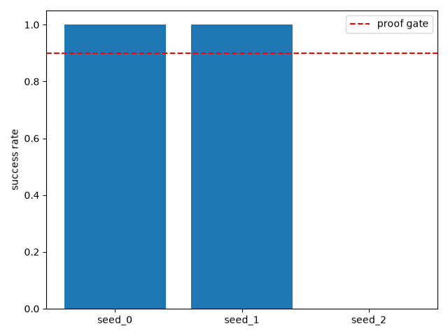

# Stage 5: Mid-episode re-goaling

## In plain English
This stage asks: if you switch the agent's target mid-task, without any
extra training for that specific situation, does it still find the new
target as reliably as if it had been given that target from the start? The
comparison is "zero-shot" (no retraining for the swap) against a
fresh-episode baseline that never experiences a switch. Across 10 seeds and
4 different points in the episode where the switch could happen, the
swapped agent matched the no-swap baseline almost exactly. The two seeds
that did worse were already known to be unreliable before any swap was
introduced (a pre-existing quirk from Stage 1, not something this stage's
re-goaling mechanism caused). This means the agent handles a change of
target mid-task about as well as it handles being given that target from
the very beginning — the re-goaling mechanism itself introduces no
measurable extra difficulty.

## Result
**Passed — zero-shot goal-swap success matched the fresh-episode baseline almost exactly across every switch point (e.g. switch at step 10: swap mean 0.858 vs. baseline mean 0.860); the only underperforming seeds were already-known unreliable seeds carried over from Stage 1, not new failures caused by re-goaling.**

## How this was tested
Ten pre-trained agents (one per seed, reused from Stage 1) were each run on
50 episodes where the target was swapped to a new location partway through
— at step 10, 20, 30, or 40 of the episode — and their success rate was
compared against two references: a baseline given the same total step
budget but never swapped, and a reference given a full, unconstrained
budget. "Success" means reaching the (post-swap) target within the episode.
Before trusting any swap result, each reused agent was first re-checked on
the original, no-swap task it was trained on, to confirm it still worked
(this is the "checkpoint-provisioning sanity check" below).

---
## Full evidence
The complete technical record — proof gate, full result tables, charts,
raw logs, anomalies, known-risks cross-check, and the reviewer
verdict — lives in [`evidence.md`](evidence.md).
