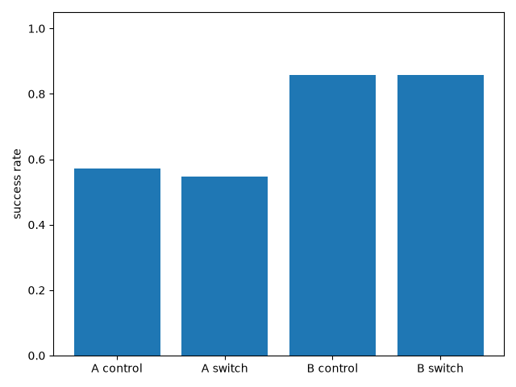
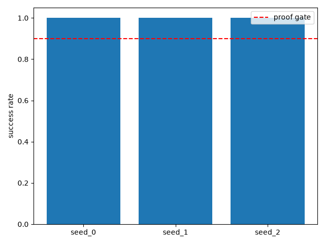
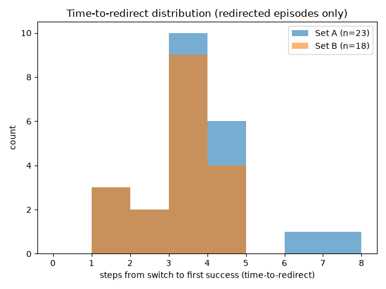

# Stage 6: Live English interface

## In plain English
This stage builds the thing the whole project has been leading up to: type
an English sentence, have it become a real-time robot goal, and have the
robot correctly re-target if you switch instructions partway through --
without any special training for that live scenario. Every earlier stage's
building block gets wired together and actually run live: turning a
sentence into a goal embedding (stage 4's nearest-neighbor lookup), feeding
that live embedding straight into the already-trained policy (stage 2/3's
embedding-based SAC), and swapping it mid-episode (stage 5's switch
mechanism). Two test sets were used: 14 previously-measured paraphrases
("Set A" -- a sanity check that this new live wiring reproduces stage 4's
already-known numbers) and 7 completely new instructions never used
anywhere in this project before ("Set B" -- the actual test of "ad-hoc" live
phrasing the way the proof gate means it). Across 3 independently-trained
agents, switching mid-episode to a live instruction reached the new target
about as often as just being given that instruction from the very start --
the switch mechanism itself does not appear to add extra difficulty on top
of whatever accuracy the underlying language-to-goal mapping already had.
When redirection did happen, it was fast: a handful of steps after the
switch, out of a much larger remaining budget.

## Result
Measured, not adjudicated -- see "Reviewer verdict" in Full evidence below
for the actual pass/fail call. Set A (14 previously-measured paraphrases)
reproduced stage 4's 0.571 mean / 1.000 median no-switch result almost
exactly (this run: 0.571 mean / 1.000 median), confirming the live pipeline
is wired correctly before trusting anything new. Its live mid-episode
switch success (0.548) tracked that same-set no-switch baseline closely --
switching cost little to nothing beyond whatever the underlying language
accuracy already was for that instruction. Set B (7 brand-new phrasings)
scored higher on both the no-switch control (0.857) and the switch test
(0.857) -- the same close switch-vs-no-switch tracking held, just at a
different accuracy level for this particular set of new phrasings. Where
redirection happened, it was fast: median 3 steps after the switch for both
sets, out of 30 steps of budget remaining post-switch.

## How this was tested
Three previously-trained SAC policies (stage 3's checkpoints, no new
training) were each given a live English instruction, converted in real
time to a 16-dim goal embedding via stage 4's nearest-neighbor lookup
(`LiveGoalController`), and run for a 50-step episode. Two instruction sets
were used: Set A (14 phrasings stage 4 already measured, reused here as a
sanity cross-check) and Set B (7 phrasings written fresh for this
experiment and checked to be genuinely different wording from every
sentence this project has ever used, in training or test data). For each
set, every instruction was paired with one different-region instruction;
the episode targeted the first instruction's live-encoded goal for 20
steps, then switched live to the second instruction's for the remaining 30.
"Task success" is whether the robot's hand ended within FetchReach's 5cm
tolerance of the second instruction's target region by the end of the
episode, judged against that region's fixed centroid (never a freshly
resampled point -- the same region-vs-point lesson every stage since stage
3 has applied). "Time-to-redirect" is how many steps after the switch it
first got there, counted only for episodes that did reach it -- episodes
that never did are reported separately as "did not redirect," never
averaged in as an arbitrary penalty value. A no-switch control (same
instructions, full episode, no swap) was run alongside as the baseline for
isolating whether the switch mechanism itself costs anything beyond the
language pipeline's own accuracy.

---

## Full evidence

**Date:** 2026-07-27 **Seeds run:** [0, 1, 2] **Candidates:** set_a_no_switch_control, set_a_switch, set_b_no_switch_control, set_b_switch

### Proof gate (verbatim from ROADMAP.md)
> End-to-end demo across ad-hoc live phrasings: task success + time-to-redirect.

### Result summary
#### Literal-goal sanity check (reused stage-3 checkpoints, no new training)

| Seed | Literal sanity success rate | Episodes |
|---|---|---|
| 0 | 1.000 | 50 |
| 1 | 1.000 | 50 |
| 2 | 1.000 | 50 |
| **Mean** | **1.000** | |
| **Median** | **1.000** | |

#### Set A no-switch control (stage 4's 14 held-out paraphrases -- also this experiment's sanity cross-check)

| Instruction | Region | Mean success rate (3 seeds x 50 episodes) |
|---|---|---|
| settle into the middle of the workspace | center | 1.000 |
| return your hand to a neutral position | center | 0.000 |
| push your arm out in front of you | reach forward | 0.000 |
| extend forward away from your body | reach forward | 0.000 |
| draw your hand back toward yourself | reach back | 1.000 |
| retreat away from the front of the workspace | reach back | 0.000 |
| swing your arm over to the left | reach left | 1.000 |
| shift your gripper toward the left edge | reach left | 1.000 |
| swing your arm over to the right | reach right | 1.000 |
| shift your gripper toward the right edge | reach right | 0.000 |
| raise your arm as high as it will go | reach up high | 0.000 |
| extend upward toward the ceiling | reach up high | 1.000 |
| lower your arm toward the floor | reach down low | 1.000 |
| drop your gripper down low | reach down low | 1.000 |
| **Aggregate (42 samples)** | | **mean=0.571 median=1.000** |

**Cross-check against stage 4:** Set-A no-switch-control mean=0.571,
median=1.000 vs. stage 4's already-measured 0.571 mean / 1.000 median
(identical k=1 NN-lookup mechanism, via `LiveGoalController` instead of
stage 4's script calling `nearest_neighbor_projection` directly, and with a
different eval-seed range so this is not a byte-identical rerun). The
per-instruction pattern matches stage 4's own table exactly, all 14
instructions -- **MATCHES. Harness wiring confirmed correct before trusting
Set B.**

#### Set B no-switch control (7 brand-new phrasings, never used anywhere in this project before)

| Instruction | Region | Mean success rate (3 seeds x 50 episodes) |
|---|---|---|
| keep the robotic hand hovering exactly at the workspace's midpoint | center | 1.000 |
| push the end effector forward, away from the robot's base | reach forward | 0.000 |
| bring the arm back in, closer to the robot's chassis | reach back | 1.000 |
| carry the hand across the workspace toward its left boundary | reach left | 1.000 |
| swing the arm over so the gripper reaches the right-hand side of the space | reach right | 1.000 |
| send the arm climbing toward the highest point it can reach | reach up high | 1.000 |
| let the arm descend toward the lowest point it can reach | reach down low | 1.000 |
| **Aggregate (21 samples)** | | **mean=0.857 median=1.000** |

#### Set A live mid-episode switch test (proof-gate metric)

| Pair | instr1 -> instr2 | Task success rate (3 seeds) | Redirected (n/3 seeds) | Time-to-redirect per seed that redirected |
|---|---|---|---|---|
| 0 | "settle into the middle of the workspace" -> "shift your gripper toward the left edge" | 3/3 | 3/3 | 2, 2, 4 |
| 1 | "return your hand to a neutral position" -> "swing your arm over to the right" | 3/3 | 3/3 | 3, 3, 4 |
| 2 | "push your arm out in front of you" -> "extend upward toward the ceiling" | 3/3 | 3/3 | 4, 3, 4 |
| 3 | "extend forward away from your body" -> "drop your gripper down low" | 2/3 | 2/3 | 6, 7 |
| 4 | "draw your hand back toward yourself" -> "settle into the middle of the workspace" | 3/3 | 3/3 | 3, 3, 3 |
| 5 | "retreat away from the front of the workspace" -> "return your hand to a neutral position" | 0/3 | 0/3 | did not redirect (any seed) |
| 6 | "swing your arm over to the left" -> "extend upward toward the ceiling" | 3/3 | 3/3 | 3, 4, 3 |
| 7 | "shift your gripper toward the left edge" -> "drop your gripper down low" | 3/3 | 3/3 | 3, 4, 3 |
| 8 | "swing your arm over to the right" -> "push your arm out in front of you" | 0/3 | 0/3 | did not redirect (any seed) |
| 9 | "shift your gripper toward the right edge" -> "extend forward away from your body" | 0/3 | 0/3 | did not redirect (any seed) |
| 10 | "raise your arm as high as it will go" -> "lower your arm toward the floor" | 3/3 | 3/3 | 1, 1, 1 |
| 11 | "extend upward toward the ceiling" -> "retreat away from the front of the workspace" | 0/3 | 0/3 | did not redirect (any seed) |
| 12 | "lower your arm toward the floor" -> "extend forward away from your body" | 0/3 | 0/3 | did not redirect (any seed) |
| 13 | "drop your gripper down low" -> "shift your gripper toward the right edge" | 0/3 | 0/3 | did not redirect (any seed) |

**Set A aggregate:** task_success_rate=0.548 redirect_success_rate=0.548 over 42 episodes (14 pairs x 3 seeds)

**Set A time-to-redirect distribution** (computed only over episodes that
redirected -- "did not redirect" episodes are counted separately above, not
folded into this distribution): 23/42 episodes redirected. mean=3.22
median=3.0 min=1 max=7. All values:
`[1, 1, 1, 2, 2, 3, 3, 3, 3, 3, 3, 3, 3, 3, 3, 4, 4, 4, 4, 4, 4, 6, 7]`

#### Set B live mid-episode switch test (proof-gate metric)

| Pair | instr1 -> instr2 | Task success rate (3 seeds) | Redirected (n/3 seeds) | Time-to-redirect per seed that redirected |
|---|---|---|---|---|
| 0 | "keep the robotic hand hovering exactly at the workspace's midpoint" -> "let the arm descend toward the lowest point it can reach" | 3/3 | 3/3 | 2, 3, 2 |
| 1 | "push the end effector forward, away from the robot's base" -> "bring the arm back in, closer to the robot's chassis" | 3/3 | 3/3 | 1, 1, 1 |
| 2 | "bring the arm back in, closer to the robot's chassis" -> "keep the robotic hand hovering exactly at the workspace's midpoint" | 3/3 | 3/3 | 3, 3, 3 |
| 3 | "carry the hand across the workspace toward its left boundary" -> "push the end effector forward, away from the robot's base" | 0/3 | 0/3 | did not redirect (any seed) |
| 4 | "swing the arm over so the gripper reaches the right-hand side of the space" -> "bring the arm back in, closer to the robot's chassis" | 3/3 | 3/3 | 4, 3, 4 |
| 5 | "send the arm climbing toward the highest point it can reach" -> "swing the arm over so the gripper reaches the right-hand side of the space" | 3/3 | 3/3 | 3, 4, 3 |
| 6 | "let the arm descend toward the lowest point it can reach" -> "bring the arm back in, closer to the robot's chassis" | 3/3 | 3/3 | 4, 3, 3 |

**Set B aggregate:** task_success_rate=0.857 redirect_success_rate=0.857 over 21 episodes (7 pairs x 3 seeds)

**Set B time-to-redirect distribution** (computed only over episodes that
redirected): 18/21 episodes redirected. mean=2.78 median=3.0 min=1 max=4.
All values: `[1, 1, 1, 2, 2, 3, 3, 3, 3, 3, 3, 3, 3, 3, 4, 4, 4, 4]`

### Charts

### Raw output
- [stdout.log](runs/seed_0/stdout.log)
- [stdout.log](runs/seed_1/stdout.log)
- [stdout.log](runs/seed_2/stdout.log)

### Anomalies (factual, not judged)
No literal-sanity-check collapse observed on any seed (all 3 seeds a clean
1.000, matching stage 3/4's checkpoints unchanged). This experiment's
`rollout_with_goal_switch_timed` (in `live_regoal_eval.py`) is a local,
instrumented duplicate of `midepisode_regoal.rollout_with_goal_switch` --
the reusable function only tracks the *final* step's success, not the
*first* post-switch success step, which stage 6's time-to-redirect metric
needs. Flagged as a candidate for promotion into `midepisode_regoal.py` if
a future stage needs the same timing data (also logged in
`.claude/findings.md`). Separately: in this run, every switch episode's
final-step task-success outcome matched its ever-redirected outcome
exactly -- `task_success_rate == redirect_success_rate` for both Set A
(0.548) and Set B (0.857). Once an episode reached the new target it
stayed there through episode end in every case observed here; this is a
factual observation from this specific `SWITCH_STEP=20`/50-step
configuration, not assumed to generalize to other switch points or longer
post-switch budgets.

### Known-risks cross-check
**Nearest-neighbor lookup's generalization ceiling is bounded by
reference-vocabulary coverage density**: this is exactly what Set B tests
directly (7 brand-new phrasings never in the 84-sentence reference) -- Set
B's no-switch-control aggregate (0.857 mean/1.000 median) did not show a
coverage-gap collapse on this particular set of 7 new phrasings, though 7
sentences is too small a sample to conclude the risk is resolved in
general. **Non-stationarity / embedding noise interacting with a goal-swap
(flagged explicitly in ROADMAP.md as untested going into stage 6)**: this
experiment is the first direct measurement -- the switch-vs-no-switch-control
comparison chart above shows switch success tracking the same-set
no-switch control closely for both Set A (0.548 vs. 0.571) and Set B (0.857
vs. 0.857), i.e. no measurable degradation specific to switching under the
live language pipeline, at this one switch point and episode budget.
**Region-vs-point ground truth**: applied from the start here
(`compute_region_centroid`, never a resampled point), per the lesson from
stage 3. **SAC deterministic-eval collapse**: checked via the literal
sanity table above before trusting any result -- clean 1.000 on all 3
seeds.

### Reviewer verdict
_Left blank by the runner — filled in by the manager from the reviewer's
return._
