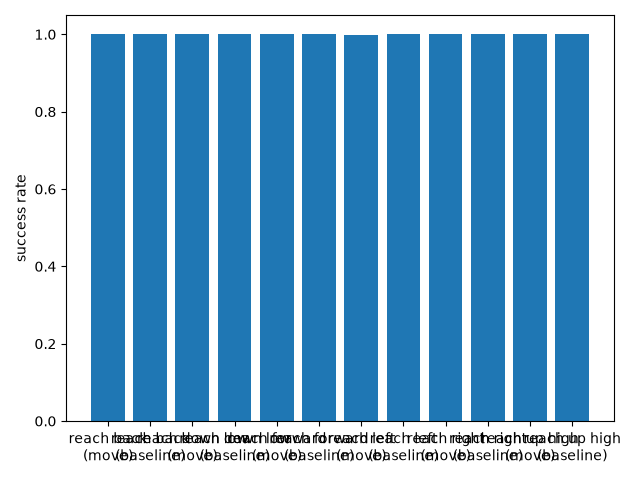
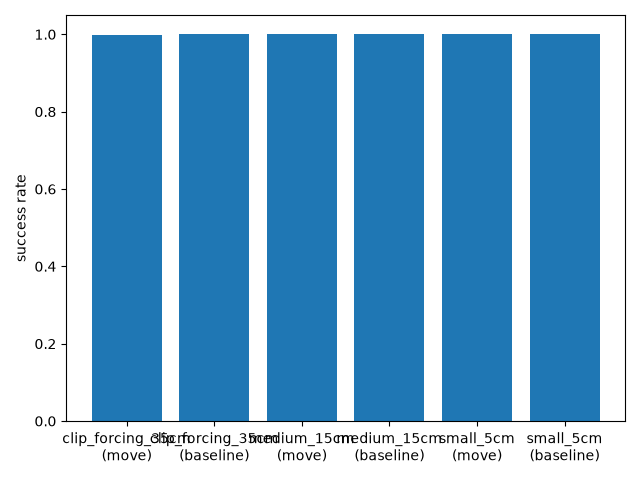
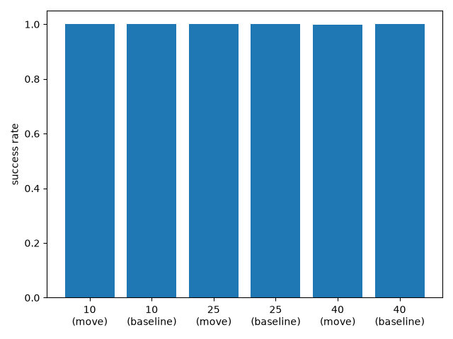
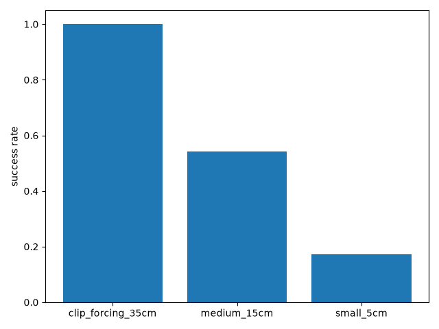

# Stage 8: Relative-move validation — Full Evidence

**Date:** 2026-07-28 **Seeds run:** [0, 1, 2, 3, 4, 5, 6, 7, 8, 9] **Candidates:** relative_move, budget_matched_baseline

### Proof gate (verbatim from ROADMAP.md)
> Reaches relative-move targets (multiple directions/magnitudes/switch-points) at a rate matching a budget-matched fresh baseline

### Result summary
#### Literal-goal sanity check (all seeds run, including known-collapse seeds 2/7 if present)

| Seed | Sanity success rate (literal control, full 50-step, no relative move) | Episodes |
|---|---|---|
| 0 | 1.000 | 50 |
| 1 | 1.000 | 50 |
| 2 (known SAC collapse seed) | 0.000 | 50 |
| 3 | 1.000 | 50 |
| 4 | 1.000 | 50 |
| 5 | 1.000 | 50 |
| 6 | 1.000 | 50 |
| 7 (known SAC collapse seed) | 0.400 | 50 |
| 8 | 1.000 | 50 |
| 9 | 1.000 | 50 |
| **Mean** | **0.840** | |
| **Median** | **1.000** | |

All breakdown tables below use only the healthy seeds ([0, 1, 3, 4, 5, 6, 8, 9]) --
seeds resembling the known SAC deterministic-eval collapse signature are
excluded from the mechanism verdict per ROADMAP.md's stage-1 lesson
("compare against baselines using the same seed count, judge at
median/mode not mean, and check whether a failed seed shows this exact
signature before attributing a regression to the new component").

#### Breakdown by direction (aggregated across switch_step, magnitude, healthy seeds)

| Direction | Relative-move mean | Relative-move median | Baseline mean | Baseline median | Clip rate | Episodes |
|---|---|---|---|---|---|---|
| reach back | 1.000 | 1.000 | 1.000 | 1.000 | 0.558 | 1440 |
| reach down low | 1.000 | 1.000 | 1.000 | 1.000 | 0.569 | 1440 |
| reach forward | 1.000 | 1.000 | 1.000 | 1.000 | 0.567 | 1440 |
| reach left | 0.999 | 1.000 | 1.000 | 1.000 | 0.581 | 1440 |
| reach right | 1.000 | 1.000 | 1.000 | 1.000 | 0.576 | 1440 |
| reach up high | 1.000 | 1.000 | 1.000 | 1.000 | 0.574 | 1440 |

#### Breakdown by magnitude (aggregated across switch_step, direction, healthy seeds)

| Magnitude | Relative-move mean | Relative-move median | Baseline mean | Baseline median | Clip rate | Episodes |
|---|---|---|---|---|---|---|
| clip_forcing_35cm | 0.999 | 1.000 | 1.000 | 1.000 | 1.000 | 2880 |
| medium_15cm | 1.000 | 1.000 | 1.000 | 1.000 | 0.541 | 2880 |
| small_5cm | 1.000 | 1.000 | 1.000 | 1.000 | 0.172 | 2880 |

#### Breakdown by switch_step (aggregated across direction, magnitude, healthy seeds)

| Switch step | Relative-move mean | Relative-move median | Baseline mean | Baseline median | Clip rate | Episodes |
|---|---|---|---|---|---|---|
| 10 | 1.000 | 1.000 | 1.000 | 1.000 | 0.565 | 2880 |
| 25 | 1.000 | 1.000 | 1.000 | 1.000 | 0.559 | 2880 |
| 40 | 0.999 | 1.000 | 1.000 | 1.000 | 0.589 | 2880 |

#### Overall aggregate (proof-gate comparison)

**Overall (all switch_steps x directions x magnitudes, 432 combos, 8640 episodes):** relative-move mean=1.000 median=1.000; budget-matched-baseline mean=1.000 median=1.000; overall clip rate=0.571

For completeness, the same aggregate including every seed run (collapse
seeds not excluded): **Overall (all switch_steps x directions x magnitudes, 540 combos, 10800 episodes):** relative-move mean=0.854 median=1.000; budget-matched-baseline mean=0.859 median=1.000; overall clip rate=0.577

### Charts

### Raw output
- [stdout.log](runs/seed_0/stdout.log)
- [stdout.log](runs/seed_1/stdout.log)
- [stdout.log](runs/seed_2/stdout.log)
- [stdout.log](runs/seed_3/stdout.log)
- [stdout.log](runs/seed_4/stdout.log)
- [stdout.log](runs/seed_5/stdout.log)
- [stdout.log](runs/seed_6/stdout.log)
- [stdout.log](runs/seed_7/stdout.log)
- [stdout.log](runs/seed_8/stdout.log)
- [stdout.log](runs/seed_9/stdout.log)

### Anomalies (factual, not judged)
clip_forcing_35cm magnitude clip rate across healthy seeds: 1.000 (confirms was_clipped=True was actually forced, not merely assumed from the algebra in the magnitude's docstring).

seed 2's literal-goal sanity check scored 0.000 (< 0.8) -- resembles the known SAC deterministic-eval collapse signature (ROADMAP.md Known risks), not necessarily a stage-8 mechanism defect.; seed 7's literal-goal sanity check scored 0.400 (< 0.8) -- resembles the known SAC deterministic-eval collapse signature (ROADMAP.md Known risks), not necessarily a stage-8 mechanism defect.

### Known-risks cross-check
**Direction-sensitivity, not just distance (stage 4)**: the by-direction breakdown table above is the direct check this risk requires -- see report.md for whether any direction under- or over-performs its peers. **SAC deterministic-eval collapse (~20% of seeds, confirmed stage 1)**: checked via the sanity-check table above before trusting any relative-move result from that seed; healthy-seed breakdown tables exclude any seed matching the collapse signature. **Non-stationarity at stage 5**: not directly applicable here -- stage 8 tests a different mid-episode capability (relative move from an arbitrary achieved position, not a caller-supplied literal goal switch), though it shares the same budget-matched-baseline comparison methodology. **Region-vs-point / NN-lookup coverage density**: not applicable -- this stage uses exact literal xyz throughout, no embedding substitution engaged, deliberately isolating the relative-move mechanism from every embedding-layer confound stages 2-4 spent effort on.

### Reviewer verdict
_Left blank by the runner — filled in by the manager from the reviewer's
return._
