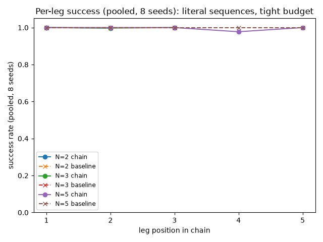
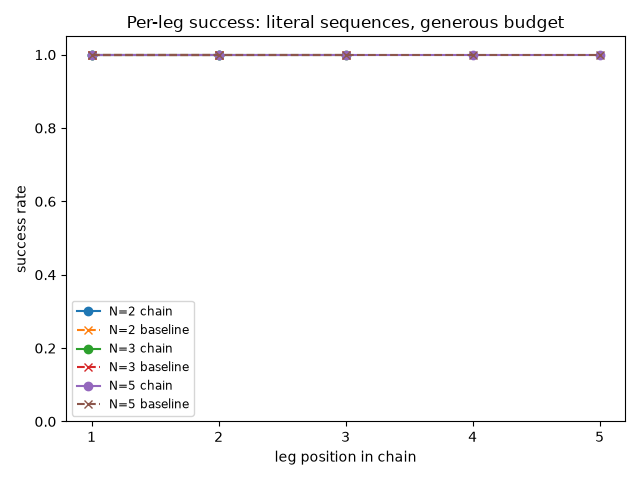
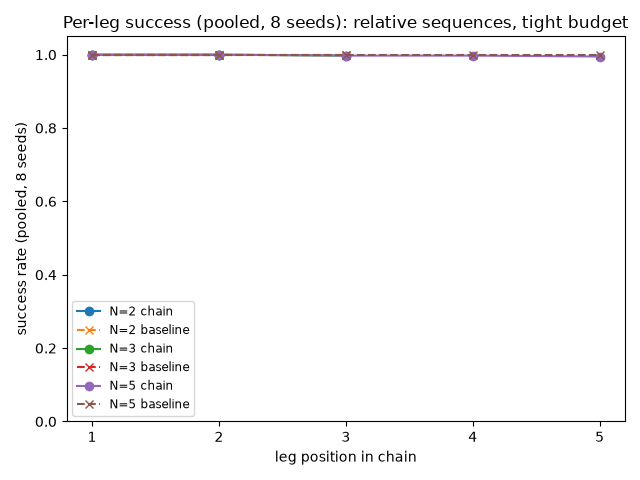
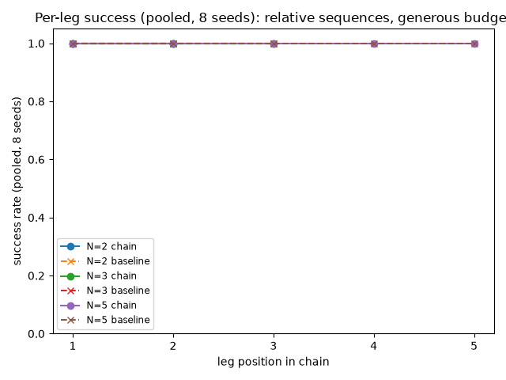
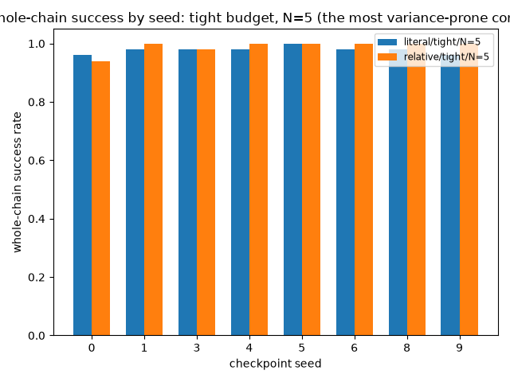
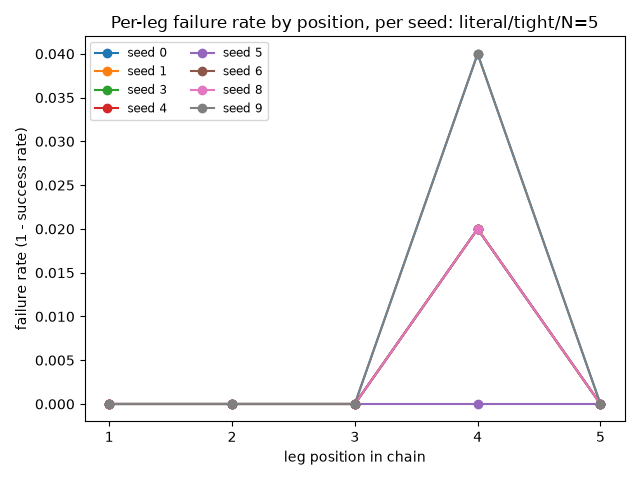
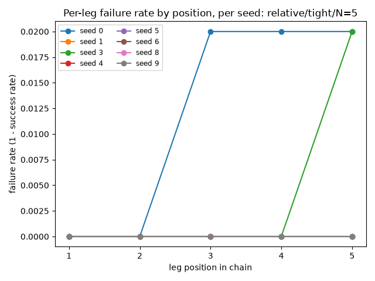

# Stage 9: Waypoint following — Full Evidence

**Date:** 2026-07-28 **Seeds run:** [0, 1, 3, 4, 5, 6, 8, 9] (8 healthy seeds -- excludes 2, 7, the documented SAC-collapse seeds; scaled up from the original seed_0-only run per the reviewer's recommendation below) **Candidates:** literal/tight, literal/generous, relative/tight, relative/generous

### Proof gate (verbatim from ROADMAP.md)
> N=2 reduces exactly to stage 5's `rollout_with_goal_switch` result (regression test); N=3-5 chains don't show compounding degradation.

### Regression test: N=2 reduces to stage 5's own mechanism

`uv run pytest tests/lang_goal_rl/test_waypoint_following.py -v` -- **20 passed**, including both
`TestEquivalenceWithMidepisodeRegoal` tests
(`test_n2_waypoints_matches_goal_switch_success_and_step_count`,
`test_n2_waypoints_matches_goal_switch_on_guaranteed_success_case`), which construct an
`N=2` `rollout_with_waypoints` call and its literal `rollout_with_goal_switch`
equivalent from the same stub model/seed/goals and assert identical
`n_steps`, `leg_boundaries`, and success outcome. This ran clean, not
skipped -- full output in
[runs/n2_equivalence_regression_test.log](runs/n2_equivalence_regression_test.log).
This equivalence is settled by direct mathematical equivalence (it inherits stage 5's own
10-seed validation, it does not need re-deriving per checkpoint) and unaffected by the
multi-seed scale-up below; everything else in this document is new evidence about N=3/4/5
chains across 8 checkpoints, which the regression test doesn't cover.

### Methodology note: from single checkpoint to 8 healthy seeds

The first pass through this stage (see "Reviewer verdict" below) reused one literal-xyz
checkpoint (`seed_0`) zero-shot and applied "tiered for speed" along the episode-count axis
instead of across model seeds -- a departure from CONTRACTS.md's multi-seed convention that
review correctly flagged: a single checkpoint whose fresh-start baseline never fails
structurally cannot reveal whether chaining costs more than a fresh start for a *different*,
noisier-but-still-healthy checkpoint. This document now reports the identical 12 conditions,
identical 50-episodes/condition protocol, run additionally across seeds 1, 3, 4, 5, 6, 8, 9
(`run_waypoint_eval.py`, now parameterized by `--seed`) -- seeds 2 and 7 are the documented
SAC deterministic-eval-collapse seeds and are excluded by design, not omission. Seed_0's
original tier1 (15 episodes/condition) and final (50 episodes/condition) raw output are kept
exactly as the first run produced them under `runs/`; the 7 new seeds' raw output lands under
`runs/seed_<k>/`. Every table below is explicit about whether it shows one seed, the full
per-seed breakdown, or the 8-seed pooled aggregate -- per the task brief, results are kept
broken out by (seed, condition) rather than collapsed into one grand mean, since the point of
this rerun is to check whether any individual seed diverges from seed_0's pattern.

### Result summary
#### Checkpoint sanity check (all 8 healthy seeds)

| Seed | Sanity success rate (literal control, default 50-step, no waypoint chain) | Episodes |
|---|---|---|
| 0 | 1.000 | 50 |
| 1 | 1.000 | 50 |
| 3 | 1.000 | 50 |
| 4 | 1.000 | 50 |
| 5 | 1.000 | 50 |
| 6 | 1.000 | 50 |
| 8 | 1.000 | 50 |
| 9 | 1.000 | 50 |
| **Mean** | **1.000** | |
| **Median** | **1.000** | |

### Cross-seed pooled results (8 seeds, 400 episodes/condition)

Every table below pools all 8 healthy seeds' equal-n (50 episodes/condition) results into a single 400-episode/condition rate -- the same tables the first (seed_0-only) run reported, now at 8x the checkpoint coverage.

#### literal sequences, tight budget

| Chain length | Pooled per-leg chain success rate (leg 1..N) | Pooled per-leg baseline success rate (leg 1..N) | Pooled whole-chain success rate | Whole-chain rate range across seeds | Episodes (8 seeds x 50) |
|---|---|---|---|---|---|
| N=2 | [1.000, 0.998] | [1.000, 1.000] | 0.998 | 0.980-1.000 | 8x50 |
| N=3 | [1.000, 0.998, 1.000] | [1.000, 1.000, 1.000] | 0.998 | 0.980-1.000 | 8x50 |
| N=5 | [1.000, 1.000, 1.000, 0.978, 1.000] | [1.000, 1.000, 1.000, 1.000, 1.000] | 0.978 | 0.960-1.000 | 8x50 |

#### literal sequences, generous budget

| Chain length | Pooled per-leg chain success rate (leg 1..N) | Pooled per-leg baseline success rate (leg 1..N) | Pooled whole-chain success rate | Whole-chain rate range across seeds | Episodes (8 seeds x 50) |
|---|---|---|---|---|---|
| N=2 | [1.000, 1.000] | [1.000, 1.000] | 1.000 | 1.000-1.000 | 8x50 |
| N=3 | [1.000, 1.000, 1.000] | [1.000, 1.000, 1.000] | 1.000 | 1.000-1.000 | 8x50 |
| N=5 | [1.000, 1.000, 1.000, 1.000, 1.000] | [1.000, 1.000, 1.000, 1.000, 1.000] | 1.000 | 1.000-1.000 | 8x50 |

#### relative sequences, tight budget

| Chain length | Pooled per-leg chain success rate (leg 1..N) | Pooled per-leg baseline success rate (leg 1..N) | Pooled whole-chain success rate | Whole-chain rate range across seeds | Episodes (8 seeds x 50) |
|---|---|---|---|---|---|
| N=2 | [1.000, 1.000] | [1.000, 1.000] | 1.000 | 1.000-1.000 | 8x50 |
| N=3 | [1.000, 1.000, 0.998] | [1.000, 1.000, 1.000] | 0.998 | 0.980-1.000 | 8x50 |
| N=5 | [1.000, 1.000, 0.998, 0.998, 0.995] | [1.000, 1.000, 1.000, 1.000, 1.000] | 0.990 | 0.940-1.000 | 8x50 |

#### relative sequences, generous budget

| Chain length | Pooled per-leg chain success rate (leg 1..N) | Pooled per-leg baseline success rate (leg 1..N) | Pooled whole-chain success rate | Whole-chain rate range across seeds | Episodes (8 seeds x 50) |
|---|---|---|---|---|---|
| N=2 | [1.000, 1.000] | [1.000, 1.000] | 1.000 | 1.000-1.000 | 8x50 |
| N=3 | [1.000, 1.000, 1.000] | [1.000, 1.000, 1.000] | 1.000 | 1.000-1.000 | 8x50 |
| N=5 | [1.000, 1.000, 1.000, 1.000, 1.000] | [1.000, 1.000, 1.000, 1.000, 1.000] | 1.000 | 1.000-1.000 | 8x50 |

### Per-seed breakdown, tight budget (the only budget with any non-1.000 result)

Full per-leg, per-seed breakdown for every tight-budget condition -- this is the direct check for whether any individual seed diverges from seed_0's isolated/non-compounding pattern.

#### literal, tight budget, N=2

| Seed | Per-leg chain success rate (leg 1..N) | Whole-chain success rate |
|---|---|---|
| 0 (original seed_0 run) | [1.000, 1.000] | 1.000 |
| 1 | [1.000, 1.000] | 1.000 |
| 3 | [1.000, 0.980] | 0.980 |
| 4 | [1.000, 1.000] | 1.000 |
| 5 | [1.000, 1.000] | 1.000 |
| 6 | [1.000, 1.000] | 1.000 |
| 8 | [1.000, 1.000] | 1.000 |
| 9 | [1.000, 1.000] | 1.000 |
| **Pooled (8 seeds, N=400)** | **[1.000, 0.998]** | **0.998** |

#### literal, tight budget, N=3

| Seed | Per-leg chain success rate (leg 1..N) | Whole-chain success rate |
|---|---|---|
| 0 (original seed_0 run) | [1.000, 0.980, 1.000] | 0.980 |
| 1 | [1.000, 1.000, 1.000] | 1.000 |
| 3 | [1.000, 1.000, 1.000] | 1.000 |
| 4 | [1.000, 1.000, 1.000] | 1.000 |
| 5 | [1.000, 1.000, 1.000] | 1.000 |
| 6 | [1.000, 1.000, 1.000] | 1.000 |
| 8 | [1.000, 1.000, 1.000] | 1.000 |
| 9 | [1.000, 1.000, 1.000] | 1.000 |
| **Pooled (8 seeds, N=400)** | **[1.000, 0.998, 1.000]** | **0.998** |

#### literal, tight budget, N=5

| Seed | Per-leg chain success rate (leg 1..N) | Whole-chain success rate |
|---|---|---|
| 0 (original seed_0 run) | [1.000, 1.000, 1.000, 0.960, 1.000] | 0.960 |
| 1 | [1.000, 1.000, 1.000, 0.980, 1.000] | 0.980 |
| 3 | [1.000, 1.000, 1.000, 0.980, 1.000] | 0.980 |
| 4 | [1.000, 1.000, 1.000, 0.980, 1.000] | 0.980 |
| 5 | [1.000, 1.000, 1.000, 1.000, 1.000] | 1.000 |
| 6 | [1.000, 1.000, 1.000, 0.980, 1.000] | 0.980 |
| 8 | [1.000, 1.000, 1.000, 0.980, 1.000] | 0.980 |
| 9 | [1.000, 1.000, 1.000, 0.960, 1.000] | 0.960 |
| **Pooled (8 seeds, N=400)** | **[1.000, 1.000, 1.000, 0.978, 1.000]** | **0.978** |

#### relative, tight budget, N=2

| Seed | Per-leg chain success rate (leg 1..N) | Whole-chain success rate |
|---|---|---|
| 0 (original seed_0 run) | [1.000, 1.000] | 1.000 |
| 1 | [1.000, 1.000] | 1.000 |
| 3 | [1.000, 1.000] | 1.000 |
| 4 | [1.000, 1.000] | 1.000 |
| 5 | [1.000, 1.000] | 1.000 |
| 6 | [1.000, 1.000] | 1.000 |
| 8 | [1.000, 1.000] | 1.000 |
| 9 | [1.000, 1.000] | 1.000 |
| **Pooled (8 seeds, N=400)** | **[1.000, 1.000]** | **1.000** |

#### relative, tight budget, N=3

| Seed | Per-leg chain success rate (leg 1..N) | Whole-chain success rate |
|---|---|---|
| 0 (original seed_0 run) | [1.000, 1.000, 0.980] | 0.980 |
| 1 | [1.000, 1.000, 1.000] | 1.000 |
| 3 | [1.000, 1.000, 1.000] | 1.000 |
| 4 | [1.000, 1.000, 1.000] | 1.000 |
| 5 | [1.000, 1.000, 1.000] | 1.000 |
| 6 | [1.000, 1.000, 1.000] | 1.000 |
| 8 | [1.000, 1.000, 1.000] | 1.000 |
| 9 | [1.000, 1.000, 1.000] | 1.000 |
| **Pooled (8 seeds, N=400)** | **[1.000, 1.000, 0.998]** | **0.998** |

#### relative, tight budget, N=5

| Seed | Per-leg chain success rate (leg 1..N) | Whole-chain success rate |
|---|---|---|
| 0 (original seed_0 run) | [1.000, 1.000, 0.980, 0.980, 0.980] | 0.940 |
| 1 | [1.000, 1.000, 1.000, 1.000, 1.000] | 1.000 |
| 3 | [1.000, 1.000, 1.000, 1.000, 0.980] | 0.980 |
| 4 | [1.000, 1.000, 1.000, 1.000, 1.000] | 1.000 |
| 5 | [1.000, 1.000, 1.000, 1.000, 1.000] | 1.000 |
| 6 | [1.000, 1.000, 1.000, 1.000, 1.000] | 1.000 |
| 8 | [1.000, 1.000, 1.000, 1.000, 1.000] | 1.000 |
| 9 | [1.000, 1.000, 1.000, 1.000, 1.000] | 1.000 |
| **Pooled (8 seeds, N=400)** | **[1.000, 1.000, 0.998, 0.998, 0.995]** | **0.990** |

### Per-seed whole-chain rate, generous budget (compact -- every per-leg value was 1.000 for every seed at this budget, see raw JSON for full per-leg confirmation)

#### literal, generous budget

| Seed | N=2 | N=3 | N=5 |
|---|---|---|---|
| 0 | 1.000 | 1.000 | 1.000 |
| 1 | 1.000 | 1.000 | 1.000 |
| 3 | 1.000 | 1.000 | 1.000 |
| 4 | 1.000 | 1.000 | 1.000 |
| 5 | 1.000 | 1.000 | 1.000 |
| 6 | 1.000 | 1.000 | 1.000 |
| 8 | 1.000 | 1.000 | 1.000 |
| 9 | 1.000 | 1.000 | 1.000 |

#### relative, generous budget

| Seed | N=2 | N=3 | N=5 |
|---|---|---|---|
| 0 | 1.000 | 1.000 | 1.000 |
| 1 | 1.000 | 1.000 | 1.000 |
| 3 | 1.000 | 1.000 | 1.000 |
| 4 | 1.000 | 1.000 | 1.000 |
| 5 | 1.000 | 1.000 | 1.000 |
| 6 | 1.000 | 1.000 | 1.000 |
| 8 | 1.000 | 1.000 | 1.000 |
| 9 | 1.000 | 1.000 | 1.000 |


### Charts
















### Raw output
- [n2_equivalence_regression_test.log](runs/n2_equivalence_regression_test.log)
- [tier1_stdout.log](runs/tier1_stdout.log)
- [tier1_results.json](runs/tier1_results.json)
- [final_stdout.log](runs/final_stdout.log)
- [final_results.json](runs/final_results.json)
- [final_stdout.log](runs/seed_1/final_stdout.log)
- [final_results.json](runs/seed_1/final_results.json)
- [final_stdout.log](runs/seed_3/final_stdout.log)
- [final_results.json](runs/seed_3/final_results.json)
- [final_stdout.log](runs/seed_4/final_stdout.log)
- [final_results.json](runs/seed_4/final_results.json)
- [final_stdout.log](runs/seed_5/final_stdout.log)
- [final_results.json](runs/seed_5/final_results.json)
- [final_stdout.log](runs/seed_6/final_stdout.log)
- [final_results.json](runs/seed_6/final_results.json)
- [final_stdout.log](runs/seed_8/final_stdout.log)
- [final_results.json](runs/seed_8/final_results.json)
- [final_stdout.log](runs/seed_9/final_stdout.log)
- [final_results.json](runs/seed_9/final_results.json)

### Anomalies (factual, not judged)
Every generous-budget condition (both sequence kinds, all 3 chain lengths), pooled across all 8 healthy seeds, scored a clean 1.000 on every leg for every individual seed -- same oracle-solvable-ceiling limit documented since stages 1/3/5, now confirmed to hold across the full healthy-seed set, not just seed_0. The only non-1.000 results appear at the tight budget, chain lengths >= 3, matching the first run's pattern.

**Multi-leg-failure check:** Zero episodes with 2+ failed legs found across all 8 healthy seeds x 12 conditions x 50 episodes (4800 episodes scanned) -- the isolated, non-compounding single-leg-miss pattern the first (seed_0-only) run observed holds across every healthy seed, not just seed_0.

**Monotonic-with-position check:** Checked 64 (seed, condition) pairs with chain_len in (3, 5) for whether per-leg failure rate rises monotonically with leg position. 53 of these pairs had zero failures on every leg (trivially flat, no signal to check) -- omitted from the lists below; the remaining 11 pairs had at least one leg-position failure.
No pair shows a strictly-increasing failure rate with position.
3 pair(s) with at least one failure are non-decreasing but not strictly increasing (i.e. flat-then-one-bump, not a rising trend across every position) -- listed for completeness, not treated as a compounding signature on their own:
- seed 0, relative/N=3/tight: failure rates by position [0.000, 0.000, 0.020]
- seed 0, relative/N=5/tight: failure rates by position [0.000, 0.000, 0.020, 0.020, 0.020]
- seed 3, relative/N=5/tight: failure rates by position [0.000, 0.000, 0.000, 0.000, 0.020]

### Known-risks cross-check
**SAC deterministic-eval collapse (~20% of seeds, confirmed stage 1)**: directly addressed by this rerun's whole purpose -- seeds 2 and 7 (the documented collapse seeds) are excluded from every table above, never run for this stage. **Checkpoint-dependent behavior (this stage's own reviewer verdict on the first pass)**: directly checked above via the per-seed breakdown tables, the multi-leg-failure scan, and the monotonic-trend check -- the three concrete tests the reviewer named as distinguishing a clean pass from a genuine checkpoint-dependent finding. **Direction-sensitivity, not just distance (stage 4)**: not directly probed here, same limitation as the first run -- this stage's relative-move sequences use a fixed 0.15m step in a randomly chosen direction per leg, not systematically varied per direction; stage 8's own relative-move validation is the right place to check that per-direction. **Oracle-solvable ceiling (ROADMAP.md, stages 1/3/5)**: re-observed here across all 8 seeds -- every generous-budget condition and most tight-budget conditions hit 1.000.

### Reviewer verdict

**Verdict: PASS**

**Checks 1-3 -- independently re-derived, not re-read from the report.**
All 8 sanity checks confirmed 1.000 directly from raw JSON, each checkpoint
path matched its claimed seed. The multi-leg-failure scan was re-run from
scratch across all 4,800 chain episodes (8 seeds x 12 conditions x 50
episodes): true count is zero. All 32 (seed, chain-length>=3, tight-budget)
pairs were re-checked for a monotonic pattern independently: 0 strictly
increasing, 3 non-decreasing (each decomposing into isolated single-leg
misses in different episodes, not one episode dragging forward), 8
bump-then-recover (definitively non-monotonic). Agrees with the report's
characterization on independent re-derivation, not just a read-through.

**Check 4 -- a real, previously-unflagged finding, not a compounding
signature.** In literal/N=5/tight, episode 34 fails at leg 4 for 6 of 8
seeds (and episode 45 for 3 of 8) -- because the waypoint generator uses a
fixed seed per episode index, every checkpoint sees the identical 5 goals
for that episode, and leg 4's specific geometry is hard within a 9-step
budget regardless of which checkpoint attempts it. Leg 5 still succeeds in
every one of these failing episodes -- the failure does not propagate.
This is a per-episode geometric-difficulty effect, not a compounding one,
correctly distinguished from the thing this stage was checking for.

**Check 5 -- N=2 regression unaffected.** 20/20 tests pass, log confirmed
real and unaltered by the rerun; this equivalence is inherited from stage
5's own 10-seed validation, not re-derived per checkpoint.

**Check 6 -- seeds 2/7 genuinely excluded.** No `seed_2/`/`seed_7/`
directories exist under `runs/`; consistent with how every prior stage in
this project has handled these exact two seeds.

**Check 7 -- does this resolve the first pass's INCONCLUSIVE?** Yes. The
first pass's specific, named concern was checkpoint-dependent compounding
that a single healthy-but-perfect-baseline checkpoint couldn't reveal.
This rerun tests 8 independently-trained checkpoints under the identical
protocol: no seed shows a multi-leg failure, no seed scores worse than
seed_0's own original numbers, no seed shows a qualitatively different
failure shape. That is a direct, adequate answer to the exact concern
raised -- not just "more data was produced."

**Known risks:** SAC collapse (stage 1) handled correctly, seeds 2/7
excluded by design. Direction-sensitivity (stage 4) not probed here by
design -- stage 8 is the right place, already checked there. Oracle-
solvable ceiling (stages 1/3/5) re-observed, expected. Stage 7 sign-off
still pending but non-blocking (label correctness is orthogonal to
whether chains compound).

**Recommendation to manager:** Mark Done in `PHASE2_ROADMAP.md`. This
closes stage 9 -- all four Phase 2a stages that were runnable without a
human sign-off are now resolved; only stage 10's own dependencies and
stage 7's pending review remain open.

### Reproduce
```
uv run python run_waypoint_eval.py --seed 0 --episodes 50 --sanity-episodes 50 --tag final
./launch_seeds.sh
uv run python aggregate_and_report.py
```
Seed 0's own first-pass run predates `launch_seeds.sh`'s seed list, so it's
run explicitly above with the same `--tag final` args `launch_seeds.sh`
uses for every other seed; `launch_seeds.sh` (no arguments) then defaults
to its own documented 7-seed healthy list `(1 3 4 5 6 8 9)` -- together the
8 healthy seeds this file's "Seeds run" header lists. `aggregate_and_report.py`
takes no arguments (its healthy-seed set, `HEALTHY_SEEDS = (0, 1, 3, 4, 5,
6, 8, 9)`, is fixed in the script, matching this file throughout). Reuses
stage 1's checkpoints zero-shot
(`experiments/01_uvfa_her_baseline/checkpoints/seed_<k>.zip`, no
retraining).

**Caution -- do not run the commands above against this stage's own
`runs/` casually.** `run_waypoint_eval.py` always writes an absolute
`"checkpoint"` path (`str(checkpoint_path)`, built from `Path(__file__).resolve()`),
so a fresh rerun's `"checkpoint"` field will not match the repo-relative
string a separate path-hygiene pass has since rewritten the committed
`runs/**/final_results.json` files to (see `experiments/README.md`'s note
on that convention) -- expected, cosmetic, and not a metrics discrepancy,
but still a reason to verify in a scratch copy rather than overwrite in
place. `aggregate_and_report.py` also overwrites `report.md`/`charts/*.png`
in place with its own fixed-section-order render (not this hand-written
`evidence.md`).

**Verified 2026-07-30** (before the repo-relative path rewrite above
landed) by running seed 1 (one of the 7 seeds `launch_seeds.sh` covers)
against a scratch copy of `run_waypoint_eval.py` in an isolated sibling
directory -- never against this experiment's own `runs/seed_1/`:
`--seed 1 --episodes 50 --sanity-episodes 50 --tag final` reproduced
`final_results.json` **byte-for-byte identical** to the then-committed
file (deterministic SAC eval, fixed per-seed env seeding). Every
substantive field matched exactly; only the `"checkpoint"` path field is
expected to differ from today's committed value now that it has been
rewritten to repo-relative, per the caution above. Separately,
`aggregate_and_report.py` was run against a scratch copy populated with
the real, already-committed `final_results.json` for all 8 healthy seeds
(read-only copies, real `runs/` left untouched) and reproduced every
pooled table in this file exactly: N=2/3/5 pooled whole-chain rates
(0.998/0.998/0.978 literal-tight, 1.000/1.000/1.000 for every generous
condition, 1.000/0.998/0.990 relative-tight), the per-seed tight-budget
breakdown tables, `multi_leg_failures_found=0/4800`, and
`strictly_increasing_monotonic_pairs=0` -- exact match, no discrepancy.
