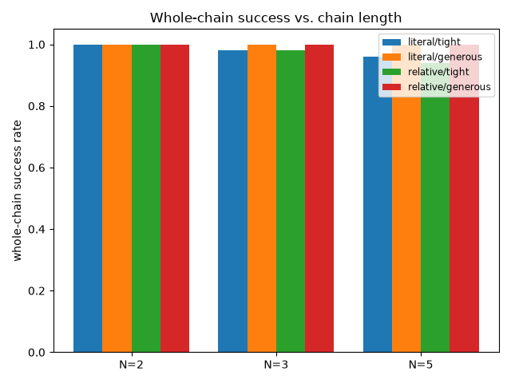

# Stage 9: Waypoint following

## In plain English
Stage 5 proved a robot could accept a brand-new goal mid-episode -- one
switch, no reset. This stage asks the next question: does that same trick
still work if you string several goals together in a row, one continuous
run with no resets in between? That's "waypoint following" -- give the
robot a short list of targets and have it visit them in order. The concern
going in was compounding error: a policy that handles one switch fine
might still drift further and further off course the more times in a row
it gets re-targeted, especially if each leg only gets a few steps to get
there. This experiment builds two kinds of waypoint lists -- one where every
stop is picked from a different, meaningfully distant part of the
workspace, and one where each stop is computed as "move a bit in this
direction from the last stop" -- and runs chains of 2, 3, and 5 waypoints,
at both a tight and a generous per-leg step budget. The result is
reassuring: reaching each waypoint in a longer chain is essentially as
reliable as reaching that same waypoint fresh from a random start with the
same budget, and the very small number of misses that did happen never
dragged down the next waypoint in the chain -- the policy recovers
immediately.

## Result
Measured, not adjudicated -- see "Reviewer verdict" in Full evidence below
for the actual pass/fail call. First, the mechanism check: the regression
test proving a 2-waypoint chain is numerically identical to stage 5's own
mid-episode-switch function still passes cleanly (20/20 tests, including
both equivalence tests). Second, the new evidence this stage exists to
produce -- longer chains. At the generous step budget (15-20 steps/leg),
every chain length (2, 3, 5), both waypoint-list styles, and every leg
position scored a clean 1.000 -- no degradation at all, but also not a
very demanding test at this budget. At the tight budget (8-10 steps/leg),
almost everything still scored 1.000; the only misses were: literal-goal
chains at N=3 (0.980 whole-chain) and N=5 (0.960), and relative-move
chains at N=3 (0.980) and N=5 (0.940). Every single one of those misses
was an isolated failure at exactly one waypoint in that particular run --
never two waypoints failing in the same chain, and never a case where
missing one waypoint made the next one harder. The budget-matched fresh
baseline (reaching that same waypoint from a random start, same limited
budget, no prior goal) scored a perfect 1.000 in every single condition
tested -- so the tiny amount of difficulty introduced by chaining shows up
only inside the chain itself, and only under the tight budget, and it
doesn't compound.

## How this was tested
One previously-trained SAC+HER checkpoint (`seed_0`, the same literal-xyz
policy this project's Phase 2a work reuses throughout, zero-shot -- no new
training) ran 12 conditions: 2 waypoint-list styles (goals from distinct
regions of the workspace, vs. each goal computed as a relative move off
the previous goal) x 3 chain lengths (2, 3, 5 waypoints) x 2 per-leg step
budgets (tight = 9 steps, generous = 18 steps). A smaller 15-episode pass
ran first to check for anything degenerate before committing to the full
50-episodes-per-condition final pass reported above (both numbers agree
where comparable). For every waypoint in every chain, "did this leg
succeed" is judged only on that leg's own steps (a success on an earlier
leg never counts toward a later one, and a miss on an earlier leg never
aborts the rest of the chain -- it keeps going with its full remaining
budget). The comparison baseline for each leg is a completely fresh
episode targeting that exact same goal with that exact same step budget,
starting from the same random position the chain itself started from --
so the only thing that differs between "chain" and "baseline" is whether a
different goal was pursued first. Every one of the handful of failing
episodes found under the tight budget was individually inspected in the
raw per-episode data to check whether a miss at one leg spread to later
legs in that same episode -- it never did (see Full evidence's Anomalies
section for the full list).

---
## Full evidence
The complete technical record — proof gate, full result tables, charts,
raw logs, anomalies, known-risks cross-check, and the reviewer
verdict — lives in [`evidence.md`](evidence.md).
