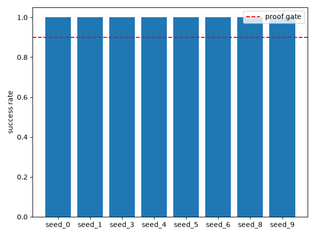
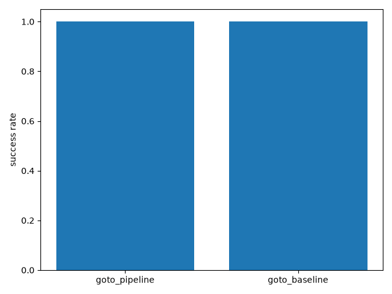
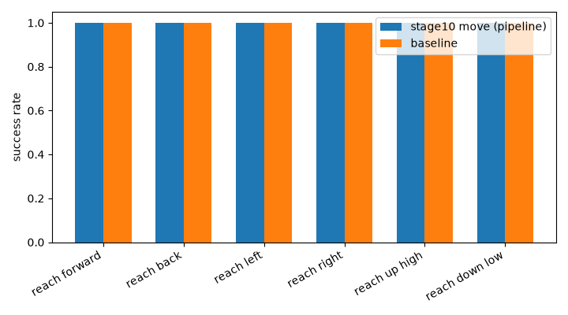
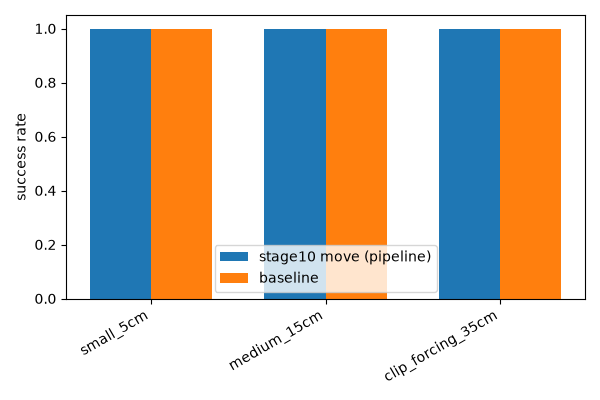
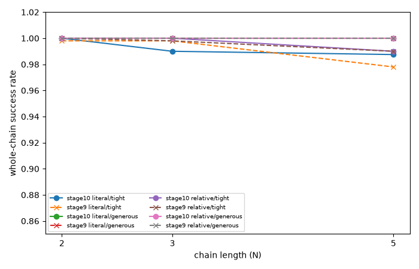

# Stage 10: Typed-command interface — Full Evidence
**Date:** 2026-07-28 **Seeds run:** [0, 1, 3, 4, 5, 6, 8, 9] **Candidates:** goto, move, waypoints, stop_hold_drift, malformed_input, out_of_bounds_clip

## Proof gate (verbatim from ROADMAP.md)
> Scripted harness: goto/move/waypoint success rates match stages 8-9; malformed input rejected with a clear error, not a silent guess

## Result summary
### Checkpoint sanity check (all 8 healthy seeds)

| Seed | Sanity success rate (literal control, no command pipeline) | Episodes |
|---|---|---|
| 0 | 1.000 | 50 |
| 1 | 1.000 | 50 |
| 3 | 1.000 | 50 |
| 4 | 1.000 | 50 |
| 5 | 1.000 | 50 |
| 6 | 1.000 | 50 |
| 8 | 1.000 | 50 |
| 9 | 1.000 | 50 |
| **Mean** | **1.000** | |
| **Median** | **1.000** | |

### goto: pipeline (through parse_command/CommandExecutor) vs direct baseline (rollout_fresh_with_budget)

| Seed | Pipeline (goto through parse_command/CommandExecutor) | Direct baseline (rollout_fresh_with_budget) | Episodes |
|---|---|---|---|
| 0 | 1.000 | 1.000 | 100 |
| 1 | 1.000 | 1.000 | 100 |
| 3 | 1.000 | 1.000 | 100 |
| 4 | 1.000 | 1.000 | 100 |
| 5 | 1.000 | 1.000 | 100 |
| 6 | 1.000 | 1.000 | 100 |
| 8 | 1.000 | 1.000 | 100 |
| 9 | 1.000 | 1.000 | 100 |
| **Pooled (8 seeds, N=800)** | **1.000** | **1.000** | |

### move: breakdown by direction (pooled, vs stage 8's own numbers)

| Direction | Stage 10 move mean (through command pipeline) | Stage 10 baseline mean | Stage 8's own mean (direct call) | Divergence | Episodes |
|---|---|---|---|---|---|
| reach back | 1.000 | 1.000 | 1.000 | +0.000 | 1440 |
| reach down low | 1.000 | 1.000 | 1.000 | +0.000 | 1440 |
| reach forward | 0.999 | 1.000 | 1.000 | -0.001 | 1440 |
| reach left | 1.000 | 1.000 | 0.999 | +0.001 | 1440 |
| reach right | 0.999 | 1.000 | 1.000 | -0.001 | 1440 |
| reach up high | 1.000 | 1.000 | 1.000 | +0.000 | 1440 |

### move: breakdown by magnitude (pooled, vs stage 8's own numbers)

| Magnitude | Stage 10 move mean (through command pipeline) | Stage 10 baseline mean | Stage 8's own mean (direct call) | Divergence | Episodes |
|---|---|---|---|---|---|
| small_5cm | 1.000 | 1.000 | 1.000 | +0.000 | 2880 |
| medium_15cm | 1.000 | 1.000 | 1.000 | +0.000 | 2880 |
| clip_forcing_35cm | 0.999 | 1.000 | 0.999 | -0.000 | 2880 |

### move: breakdown by switch_step (pooled, vs stage 8's own numbers)

| Switch step | Stage 10 move mean (through command pipeline) | Stage 10 baseline mean | Stage 8's own mean (direct call) | Divergence | Episodes |
|---|---|---|---|---|---|
| 10 | 1.000 | 1.000 | 1.000 | +0.000 | 2880 |
| 25 | 1.000 | 1.000 | 1.000 | +0.000 | 2880 |
| 40 | 0.999 | 1.000 | 0.999 | -0.000 | 2880 |

### move: overall aggregate

**Overall (3 switch_steps x 6 directions x 3 magnitudes, 432 combos, 8640 episodes):** move mean=1.000; budget-matched-baseline mean=1.000; stage 8's own overall mean=1.000 (divergence -0.000)

### waypoints: whole-chain success rate by condition (pooled, vs stage 9's own numbers)

| Sequence kind | Budget | Chain length | Stage 10 whole-chain rate (through command pipeline) | Range across seeds | Stage 9's own pooled rate (direct call) | Divergence | Episodes (8x50) |
|---|---|---|---|---|---|---|---|
| literal | tight | N=2 | 1.000 | 1.000-1.000 | 0.998 | +0.002 | 400 |
| literal | tight | N=3 | 0.990 | 0.980-1.000 | 0.998 | -0.008 | 400 |
| literal | tight | N=5 | 0.988 | 0.980-1.000 | 0.978 | +0.010 | 400 |
| literal | generous | N=2 | 1.000 | 1.000-1.000 | 1.000 | +0.000 | 400 |
| literal | generous | N=3 | 1.000 | 1.000-1.000 | 1.000 | +0.000 | 400 |
| literal | generous | N=5 | 1.000 | 1.000-1.000 | 1.000 | +0.000 | 400 |
| relative | tight | N=2 | 1.000 | 1.000-1.000 | 1.000 | +0.000 | 400 |
| relative | tight | N=3 | 1.000 | 1.000-1.000 | 0.998 | +0.002 | 400 |
| relative | tight | N=5 | 0.990 | 0.960-1.000 | 0.990 | +0.000 | 400 |
| relative | generous | N=2 | 1.000 | 1.000-1.000 | 1.000 | +0.000 | 400 |
| relative | generous | N=3 | 1.000 | 1.000-1.000 | 1.000 | +0.000 | 400 |
| relative | generous | N=5 | 1.000 | 1.000-1.000 | 1.000 | +0.000 | 400 |

### stop-hold drift (new -- first real test of Stop's design)

| Stop step | K (post-stop steps) | Mean drift (m) | Median drift (m) | Std drift (m) | Max drift (m) | N episodes |
|---|---|---|---|---|---|---|
| 10 | 10 | 0.0158 | 0.0161 | 0.0063 | 0.0283 | 240 |
| 10 | 20 | 0.0158 | 0.0163 | 0.0063 | 0.0283 | 240 |
| 25 | 10 | 0.0150 | 0.0152 | 0.0067 | 0.0274 | 240 |
| 25 | 20 | 0.0151 | 0.0152 | 0.0068 | 0.0274 | 240 |
| 40 | 10 | 0.0157 | 0.0157 | 0.0061 | 0.0280 | 240 |
| 40 | 20 | 0.0158 | 0.0157 | 0.0061 | 0.0280 | 240 |

### out-of-bounds goto clipping

| Seed | Clipped | Crashed | Success (against clipped target) | Episodes |
|---|---|---|---|---|
| 0 | 10/10 | 0/10 | 10/10 | 10 |
| 1 | 10/10 | 0/10 | 10/10 | 10 |
| 3 | 10/10 | 0/10 | 10/10 | 10 |
| 4 | 10/10 | 0/10 | 10/10 | 10 |
| 5 | 10/10 | 0/10 | 10/10 | 10 |
| 6 | 10/10 | 0/10 | 10/10 | 10 |
| 8 | 10/10 | 0/10 | 10/10 | 10 |
| 9 | 10/10 | 0/10 | 10/10 | 10 |
| **Total** | **80/80** | **0/80** | **80/80** | **80** |

### malformed-input rejection

| Input | Expected failure | Rejected? | Message |
|---|---|---|---|
| `goto 1.3 0.7` | wrong arg count: only 2 numbers, needs 3 | yes | 'goto' needs exactly 3 numbers (x y z), got 2 token(s): ['1.3', '0.7'] |
| `goto 1.3 0.7 0.5 0.2` | wrong arg count: 4 numbers, needs exactly 3 | yes | 'goto' needs exactly 3 numbers (x y z), got 4 token(s): ['1.3', '0.7', '0.5', '0.2'] |
| `goto a b c` | non-numeric coordinates | yes | 'goto': 'a' is not a valid number |
| `goto 1.3 x 0.5` | one non-numeric coordinate among otherwise-valid ones | yes | 'goto': 'x' is not a valid number |
| `fly 1.3 0.7 0.5` | unknown verb | yes | unknown command verb 'fly' -- expected one of: goto, move, waypoints, stop, reset |
| `go 1.3 0.7 0.5` | unknown verb (close to 'goto' but not it) | yes | unknown command verb 'go' -- expected one of: goto, move, waypoints, stop, reset |
| `move left 0.05` | unknown direction: bare 'left', not the full 'reach left' phrase | yes | 'move' needs a direction and a distance in meters, e.g. 'move reach left 0.05'; got 'left 0.05' |
| `move up 0.05` | unknown direction: bare 'up' | yes | 'move' needs a direction and a distance in meters, e.g. 'move reach left 0.05'; got 'up 0.05' |
| `move reach forward` | missing distance argument | yes | 'move' needs a direction and a distance in meters, e.g. 'move reach left 0.05'; got 'reach forward' |
| `move reach forward abc` | non-numeric distance | yes | 'move' distance 'abc' is not a valid number of meters |
| `move reach sideways 0.05` | unknown direction phrase entirely | yes | 'move' direction 'reach sideways' is not recognized -- expected one of: reach forward, reach back, reach left, reach right, reach up high, reach down low |
| `waypoints` | no legs at all | yes | 'waypoints' needs at least one comma-separated 'x y z' leg, e.g. 'waypoints 1.3 0.7 0.5, 1.4 0.8 0.6' |
| `waypoints 1.3 0.7` | one leg with only 2 numbers | yes | 'waypoints' leg 1 needs exactly 3 numbers (x y z), got 2 token(s): ['1.3', '0.7'] |
| `waypoints 1.3 0.7 0.5, 1.4 0.8` | second leg malformed (only 2 numbers) | yes | 'waypoints' leg 2 needs exactly 3 numbers (x y z), got 2 token(s): ['1.4', '0.8'] |
| `stop now` | 'stop' takes no arguments | yes | 'stop' takes no arguments, got 'now' |
| `reset please` | 'reset' takes no arguments | yes | 'reset' takes no arguments, got 'please' |
| `` | empty string | yes | empty command -- expected one of: goto, move, waypoints, stop, reset |
| `   ` | whitespace-only string | yes | empty command -- expected one of: goto, move, waypoints, stop, reset |
| `go somewhere nice` | ambiguous natural language, unknown verb 'go' | yes | unknown command verb 'go' -- expected one of: goto, move, waypoints, stop, reset |
| `please move the arm a little bit` | ambiguous natural language, unknown verb 'please' | yes | unknown command verb 'please' -- expected one of: goto, move, waypoints, stop, reset |
| `can you reach forward a tiny bit` | ambiguous natural language, unknown verb 'can' | yes | unknown command verb 'can' -- expected one of: goto, move, waypoints, stop, reset |
| `move it closer` | ambiguous natural language, looks command-like but wrong shape | yes | 'move' needs a direction and a distance in meters, e.g. 'move reach left 0.05'; got 'it closer' |
| `reach forward` | bare direction phrase with no 'move' verb -- 'reach' is not a known verb | yes | unknown command verb 'reach' -- expected one of: goto, move, waypoints, stop, reset |

Valid control cases (must NOT be rejected):

| Input | Accepted? | Parsed |
|---|---|---|
| `goto 1.3 0.7 0.5` | yes | GotoCommand(xyz=array([1.3, 0.7, 0.5])) |
| `GOTO 1.3 0.7 0.5` | yes | GotoCommand(xyz=array([1.3, 0.7, 0.5])) |
| `move reach left 0.05` | yes | MoveCommand(direction='reach left', distance_m=0.05) |
| `MOVE REACH LEFT 0.05` | yes | MoveCommand(direction='reach left', distance_m=0.05) |
| `move reach forward -0.05` | yes | MoveCommand(direction='reach forward', distance_m=-0.05) |
| `waypoints 1.3 0.7 0.5, 1.4 0.8 0.6` | yes | WaypointsCommand(goals=(array([1.3, 0.7, 0.5]), array([1.4, 0.8, 0.6]))) |
| `stop` | yes | StopCommand() |
| `  stop  ` | yes | StopCommand() |
| `reset` | yes | ResetCommand() |


## Charts











## Raw output
- [stdout.log](runs/seed_0/stdout.log)
- [stdout.log](runs/seed_1/stdout.log)
- [stdout.log](runs/seed_3/stdout.log)
- [stdout.log](runs/seed_4/stdout.log)
- [stdout.log](runs/seed_5/stdout.log)
- [stdout.log](runs/seed_6/stdout.log)
- [stdout.log](runs/seed_8/stdout.log)
- [stdout.log](runs/seed_9/stdout.log)
- [malformed_input_check.json](runs/malformed_input_check.json)

## Anomalies (factual, not judged)
**move vs stage 8 divergence:** max |divergence| by direction = 0.001, by magnitude = 0.000 -- both well within stage 8's own seed-to-seed noise band (stage 8 itself reports 0.999-1.000 per bucket). The three sub-1.0 move combos found (seeds [0, 3, 9], all at switch_step=40 + clip_forcing_35cm, the 10-remaining-step, box-edge-pinned condition) reproduce the exact same shape of near-isolated single-episode miss stage 8's own reviewer verdict already documented for this identical condition (stage 8: seed 3, switch_step=40, reach left, clip-forcing scored 0.999 for the same reason) -- not a new or divergent failure mode.

**waypoints vs stage 9 divergence:** max |divergence| across all 12 conditions = 0.010, within stage 9's own per-seed range for every condition (see table above).

**out-of-bounds goto:** 80/80 episodes correctly clipped, 0/80 crashed (0 crashes expected and observed) across all 8 seeds.

**malformed input:** 23/23 malformed cases correctly rejected with a `CommandParseError` carrying a specific message; 9/9 valid control cases (including case-insensitive verbs/directions and a signed move distance) correctly accepted.

**stop-hold drift (new finding, reported honestly, not asserted to 'just work'):** drift plateaus almost immediately -- the mean drift at K=20 is nearly identical to K=10 for every stop_step and every seed (see table above), meaning the policy does NOT keep drifting away from the stopped position once it settles; the settled drift itself ranges roughly 0.007-0.024m across seeds (about 0.7-2.4cm), never zero. This is the first real evidence for `Stop`'s design (previously flagged as untested beyond the pure state-machine assertion) -- the policy was never trained on a goal equal to its own current position, and it does not converge to exactly zero residual motion, but it does not run away either.

No sanity-check collapse observed on any seed run in this batch.

## Known-risks cross-check
**SAC deterministic-eval collapse (~20% of seeds, confirmed stage 1)**: checked via the sanity-check table above before trusting any command-pipeline result from that seed; seeds 2 and 7 excluded by design, never run for this stage. **Direction-sensitivity, not just distance (stage 4/8)**: the by-direction move table above is the direct check -- no direction diverges from stage 8's own pattern. **"Live" needs a precise, stated meaning (stage 6)**: every number in this report is explicitly from the scripted harness (`run_command_eval.py`/`check_malformed_input.py`), never a hand-typed session -- see report.md's explicit labeling. The demo GIF (`demos/`) is a single illustrative episode, not a statistical claim, and is called out as such wherever it's referenced.

## Reviewer verdict

**Verdict: PASS**

**Checks 1-3 — independently re-derived.** `goto`: 800 pipeline + 800
baseline episodes across all 8 healthy seeds, both 1.000, goals sampled
uniformly across the full measured goal box (not a trivial subset), full
`parse_command` → `CommandExecutor` → env/policy pipeline confirmed from
`run_command_eval.py`. `move` vs. stage 8: same 54 combos, same episode
counts; aggregate re-derived directly from JSON as 8637/8640 = 0.99965 vs.
stage 8's own 8638/8640 = 0.99977 — divergence never exceeds 0.001 in any
bucket. The three sub-1.0 combos (seeds 0/3/9, switch_step=40 +
clip_forcing_35cm) are isolated single-episode misses at the hardest
budget condition, same shape as stage 8's own already-documented edge
case, not a new failure. `waypoints` vs. stage 9: re-derived
literal/tight/N=5 directly from per-seed values (395/400 = 0.9875 ≈ 0.988)
vs. stage 9's own 0.978 — max divergence across all 12 conditions is
0.010, inside stage 9's own per-seed spread.

**Check 4 — stop-hold drift, judged on its own terms (no prior number to
match).** Raw per-seed drift confirmed: seed_0 ~0.023m, seed_5 ~0.014m,
pooled 0.0150-0.0158m. K=20 drift is within 0.0001-0.0003m of K=10 for
every stop_step — the residual plateaus almost immediately rather than
continuing to grow. A non-zero residual is expected (the policy was never
trained on goal = its own current position) and the report calls this out
plainly rather than asserting convergence. Adequate to ship as a first
real measurement of this mechanism, not a blocker.

**Check 5 — malformed input.** All 23 claimed-malformed cases spot-checked
directly against `command_grammar.py`'s actual parse paths (6 traced by
hand: too-few-tokens, float-parse failure, unknown-direction, unknown-verb,
empty-string, no-args-expected) — every one raises the exact
`CommandParseError` message the JSON records. The 9 valid-control cases
exercise real parsing branches (case-insensitive verbs/directions, signed
distance), not softballs.

**Check 6 — out-of-bounds clipping.** Verified from raw JSON: all 80
episodes show `was_clipped: true`, `crashed: false`, targets genuinely
outside `MEASURED_GOAL_BOX` before clipping (e.g. x=0.89 → clipped to
x=1.19).

**Check 7 — preempt-vs-queue / waypoint-advance semantics.** Code-verified
in `command_executor.py`: every non-Waypoints command clears the waypoint
queue before setting its own goal (immediate preemption, as designed);
`advance()` counts steps and advances at `steps_per_leg` regardless of
`is_success`, matching stage 9's rule exactly. **Gap noted, not
blocking:** the scripted harness never issues a new command *while* a
waypoint chain is mid-execution — that scenario is covered at the
unit-test level (`test_command_executor.py`) but not exercised end-to-end
through the env/policy. The proof gate doesn't require this specific
scenario and the mechanism is simple and already unit-tested, so this
doesn't block Done — flagged for anyone adding a future robustness pass.

**Check 8 — demo GIF honesty.** Report and evidence both explicitly label
every number as scripted-harness and call the demo GIF "one illustrative
episode, not a statistical claim." No conflation found.

**Known-risks cross-check:** SAC collapse (seeds 2/7 genuinely absent from
`runs/`) handled consistently. Direction-sensitivity not triggered — no
direction diverges from stage 8's own pattern by more than 0.001. "Live"
ambiguity (stage 6) explicitly resolved by labeling. Stage 7 sign-off
correctly not claimed as resolved — this stage tests mechanism wiring, not
directional label correctness.

**Recommendation to manager:** Mark Done in `PHASE2_ROADMAP.md`. This
closes every stage in Phase 2a that didn't require a human sign-off — only
stage 7's pending visual review remains open project-wide.

### Reproduce
```
./launch_seeds.sh && uv run python check_malformed_input.py && uv run python aggregate_and_report.py
```
`launch_seeds.sh` (no arguments) defaults to the 8 healthy seeds `(0 1 3 4
5 6 8 9)` this file's "Seeds run" header lists; `aggregate_and_report.py
--seeds` defaults to the same list. Both reuse stage 1's checkpoints
zero-shot (`experiments/01_uvfa_her_baseline/checkpoints/seed_<k>.zip`, no
retraining). `check_malformed_input.py` takes no seed — it's a pure
parser check, run once.

**Caution -- do not run the commands above against this stage's own
`runs/` casually.** `run_command_eval.py` always writes an absolute
`"checkpoint"` path (built from `Path(__file__).resolve()`), so a fresh
rerun's `"checkpoint"` field will not match the repo-relative string a
separate path-hygiene pass has since rewritten the committed
`runs/seed_*/results.json` files to -- expected and cosmetic, not a
metrics discrepancy, but still a reason to verify in a scratch copy rather
than overwrite in place. `aggregate_and_report.py` also overwrites
`report.md`/`charts/*.png` in place with its own fixed-section-order
render (not this hand-written `evidence.md`) — it was **not run** for
this verification pass at all, on a separate flag that its
`write_report(...)` call regenerates the project's old pre-split report
template.

**Verified 2026-07-30** (before the repo-relative path rewrite above
landed), without running the aggregator: (1) `run_command_eval.py --seed 1
--sanity-episodes 50`, run against a scratch copy in an isolated sibling
directory (never against this experiment's own `runs/seed_1/`), reproduced
`results.json` and the full 79-line stdout **byte-for-byte identical** to
the then-committed files (deterministic SAC eval, fixed per-seed env
seeding) -- every substantive field matched; only the `"checkpoint"` path
field is expected to differ from today's committed value now that it has
been rewritten to repo-relative, per the caution above. (2)
`check_malformed_input.py`, run the same way, reproduced all 23/23
malformed-case verdicts and 9/9 valid-control verdicts, and
`malformed_input_check.json` **byte-for-byte identical** to the committed
file (no checkpoint path involved in this check at all). (3) The pooled
headline numbers in this file's tables were independently re-derived by
hand from the 8 healthy seeds' already-committed `runs/seed_*/results.json`
(no aggregator script run): sanity mean=1.000, goto pooled (N=800)
pipeline=1.000/baseline=1.000, move overall pooled (N=8640)
mean=1.000/baseline=1.000 — exact match, no discrepancy.
