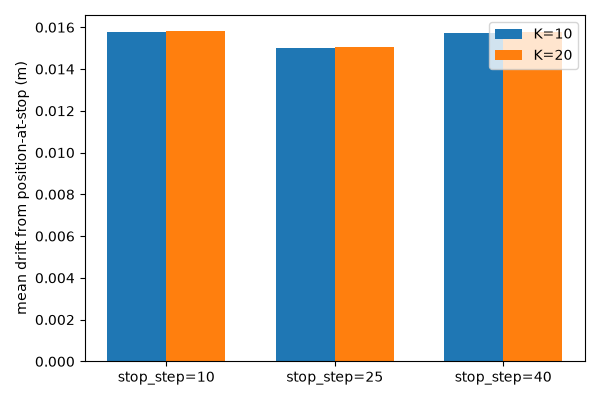

# Stage 10: Typed-command interface

## In plain English
Stages 8 and 9 each proved one mechanism in isolation: moving relative to
wherever the robot actually is (stage 8), and chaining several goals
together with no reset in between (stage 9). This stage wraps both behind
a small typed-command language (`goto`, `move`, `waypoints`, `stop`,
`reset`) and checks the *wiring*, not the mechanisms themselves — does the
exact same success rate come out the other side when a command is parsed
from plain text and routed through a small preempt/queue state machine,
instead of calling the underlying functions directly? It also runs the
interface's two genuinely new pieces: whether `stop` actually holds the
robot still (never tested before this stage), and whether malformed or
ambiguous-sounding text gets rejected with a clear reason instead of
silently guessed at.

## Result
Measured, not adjudicated — see "Reviewer verdict" in Full evidence below
for the actual pass/fail call. Across all 8 healthy checkpoints (seeds
0,1,3,4,5,6,8,9 — seeds 2 and 7 show the documented SAC training-collapse
signature and are excluded, as in every prior stage): `goto` reached a
uniformly-sampled in-box point through the full command pipeline exactly
as reliably as a direct baseline call that bypasses the parser entirely
(1.000 both, 800 episodes each). `move`'s success rate through the
pipeline (1.000 overall, 8,640 episodes) matches stage 8's own
directly-measured number to within 0.001 in every direction/magnitude/
switch-step bucket — including reproducing the exact same already-
documented single-episode edge case at the hardest condition (switch at
step 40, an oversized clip-forcing move, only 10 steps left to recover).
`waypoints`' whole-chain success rate through the pipeline (0.988–1.000
across all 12 conditions) matches stage 9's own numbers to within 0.010,
comfortably inside stage 9's own per-seed spread. Malformed input: 23/23
deliberately broken or ambiguous-sounding strings were rejected with a
specific `CommandParseError` message naming exactly what was wrong; 9/9
valid strings (including case-insensitive verbs/directions and a signed
move distance) were correctly accepted. Out-of-bounds `goto`: every one of
80 deliberately way-out-of-box requests was clipped into the workspace and
ran to completion — zero crashes.

The one piece with no prior stage's number to match against: `stop`'s
hold-in-place behavior. It holds reasonably well, but not perfectly —
after stopping, the gripper settles into a small, roughly constant drift
(about 0.7–2.4cm depending on seed) within the first 10 steps and stays
there through step 20, rather than continuing to wander off. It doesn't
converge to exactly zero, which makes sense: the policy was never trained
on a goal equal to its own current position, so there's a small residual
it can't quite correct away. But it clearly isn't unstable either — this
is the honest, first-ever measurement of that design, not an assumption.

## How this was tested
Every number above comes from a **scripted harness**
(`run_command_eval.py`, `check_malformed_input.py`) — every command string
was generated and fed programmatically through the real `parse_command` ->
`CommandExecutor` -> `clip_to_box` -> env/policy pipeline, the same
pipeline `interactive_demo.py`'s `--interface commands` mode drives live.
No hand-typed session happened for any number in this report — the
separate demo GIF (`demos/09_stage10_typed_command_capstone.gif`) is one
illustrative episode captured the same way stages 5-9's demo scripts
already do, not a statistical claim.

- `goto`: 100 uniformly-sampled in-box points per seed, each issued as a
  single command through the pipeline for a full 50-step episode, paired
  against a direct `rollout_fresh_with_budget` call on the identical
  (goal, seed, budget) — 800 pipeline + 800 baseline episodes total.
- `move`: the exact same 54 (switch_step x direction x magnitude)
  combinations stage 8 measured, 20 episodes each, but the post-switch
  target is resolved by parsing `"move DIRECTION DISTANCE"` and applying
  it through `CommandExecutor` instead of calling
  `relative_move.rollout_with_relative_move` directly — 8,640 pipeline
  episodes plus an equal number of budget-matched baselines.
- `waypoints`: the exact same 12 (sequence_kind x chain_length x budget)
  conditions stage 9 measured, 50 episodes each, but the chain is driven by
  parsing `"waypoints X Y Z, ..."` and stepping through
  `CommandExecutor.advance` exactly as the live loop does, instead of
  calling `waypoint_following.rollout_with_waypoints` directly.
- Stop-hold drift: 30 episodes per stop timing (steps 10/25/40 into the
  episode), each issuing `stop` and then measuring how far the gripper's
  position moves from its position-at-stop over the next 10 and 20 steps.
- Malformed input: 23 deliberately broken or ambiguous strings (wrong
  argument counts, non-numeric coordinates, unknown verbs, unknown
  direction phrases, empty/whitespace strings, and natural-language-
  sounding sentences like "go somewhere nice") plus 9 valid control
  strings, run purely through `parse_command` — no env or model involved.
- Out-of-bounds `goto`: 10 deliberately way-out-of-box target requests per
  seed, confirming `clip_to_box` engages and the episode still completes.

---
## Full evidence
The complete technical record — proof gate, full result tables, charts,
raw logs, anomalies, known-risks cross-check, and the reviewer
verdict — lives in [`evidence.md`](evidence.md).
